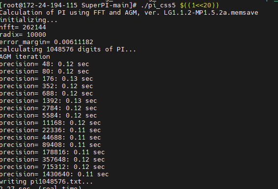
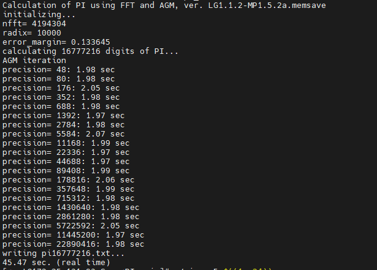
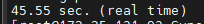
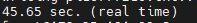
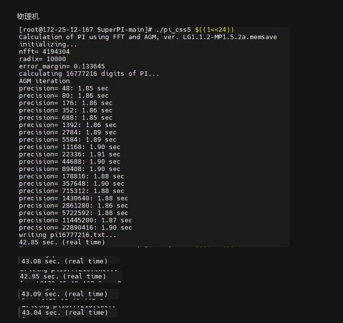
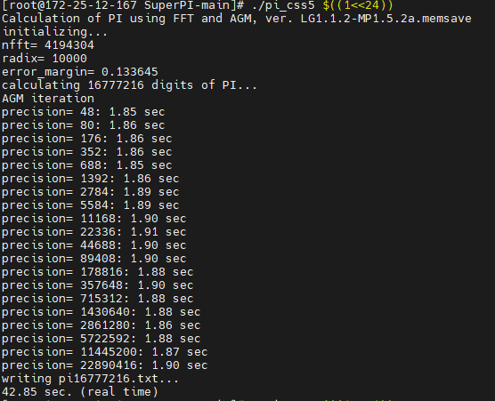
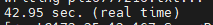
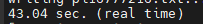
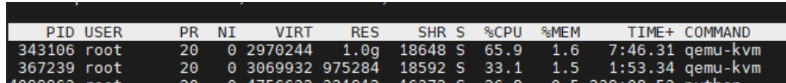
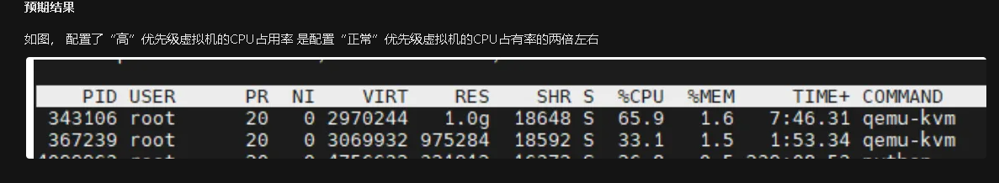

为完成  标记   nark  furina

求 

我跑去看阿里云和京东云的性能测试报告 看到了他们的CPU性能报告往往都包含了Unixbench和SUPER PI 所以周末的时候做了这个的调研和测试 

https://superpi.ilbello.com/

目前的官网 分为Windows和Linux 两个版本 两个版本的SUPERPI得分不可以一起评估 因为计算方法底层不一样 


部署 

#### github的源 linux （https://github.com/Fibonacci43/SuperPI）  现在 字节 京东 都用的这个源

```
wget  http://smb.zstack.io/mirror/lei.zhang/SUPERPI/SuperPI-main.zip
yum install unzip -y 
unzip SuperPI-main.zip
yum install  glibc  -y
yum install  glibc make -y
cd  SuperPI-main   
yum install  glibc-static  -y
yum install -y glibc-devel
ldd --version

gcc -O -funroll-loops -fomit-frame-pointer pi_fftcs.c fftsg_h.c -lm -o pi_css5
ls
```

直接gcc编译就好了  不知道为啥  我们的会报错说找不到glibc的依赖 -lm -lc 没有 


```


```

https://superpi.ilbello.com/ 

#### 官网的原  win 


```

```


运行

```
ls
./pi_css5 $((1<<20))
```

到他的路径下面   $((1<<20))  表示算到几位 1<<20)  表示2的20 次方位   主要参考指标是时间  





一次实验记录

单纯的浮点数计算

简单的单核性能验证 

```python
wget  http://smb.zstack.io/mirror/lei.zhang/SUPERPI/SuperPI-main.zip
yum install unzip -y
unzip SuperPI-main.zip
yum install  glibc  -y
yum install  glibc make -y
cd  SuperPI-main  
yum install  glibc-static  -y
yum install -y glibc-devel
ldd --version

gcc -O -funroll-loops -fomit-frame-pointer pi_fftcs.c fftsg_h.c -lm -o pi_css5
ls
ls
./pi_css5 $((1<<24))
```


###### 虚拟机









```python
avg = 45.61
```


物理机











```python
avg = 43.002
```

配置项： 虚拟机硬件-CPU-CPU资源优先级

配置条目 ： “高” “正常”

描述 ： 主机负载率过高，出现 CPU 资源竞争时，资源优先级为“高”的虚拟机提供较“正常”虚拟机高出一倍的资源抢夺能力。

具体场景： 比如 vm1 : vm:2 (vm1:优先级高，vm2:优先级正常)，在CPU竞争的场景里，获得CPU占用率 VM1是VM2的两倍 

###### 测试步骤

1. 在同一个计算节点上创建两台虚拟机（规格 1C1G）记作 VM1 ，VM2
2. 将两台虚拟机的CPU pin在计算节点的同一个核上（如下图）


1. 进入两台虚拟机， 上传SuperPI 资源包 （或者自行下载源 https://github.com/Fibonacci43/SuperPI）
2. 确保虚拟机内部`unzip  , glibc , make , glibc-static , glibc-devel`等 依赖 存在，
3. 解压缩并进入c文件所在目录

```python
unzip SuperPI-main.zip
cd  SuperPI-main
```

1. 使用 `gcc -O -funroll-loops -fomit-frame-pointer pi_fftcs.c fftsg_h.c -lm -o pi_css5`编译c文件
2. 使用`ls` 确认`pi_css5`存在
3. 登录虚拟机所在计算节点 使用`ps aux | grep -i 'kvm' | grep -i '<虚拟机的UUID>'`来确认运行的虚拟机kvm进程pid
4. 到两台虚拟机`pi_css5`所在目录运行 `./pi_css5 $((1<<26))` （其中 $((1<<n)) 表示计算PI算到小数点后2的第n 次方位）
5. 登录虚拟机所在计算节点， 使用`top -p <VM1对应pid>，<VM2对应pid> `查看CPU占有率 


###### 预期结果

如图， 配置了“高”优先级虚拟机的CPU占用率 是配置“正常”优先级虚拟机的CPU占有率的两倍左右

