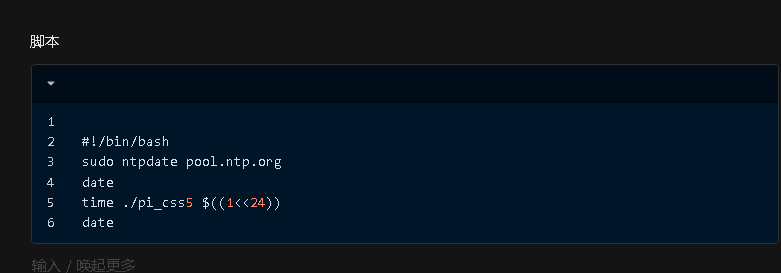
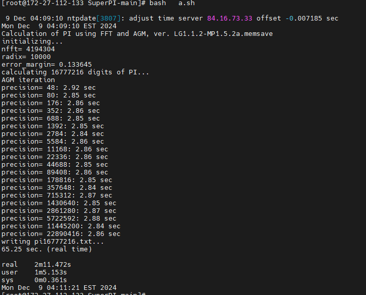
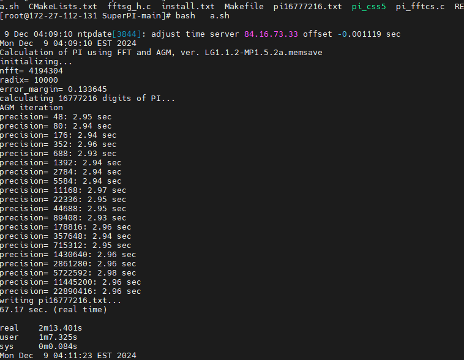
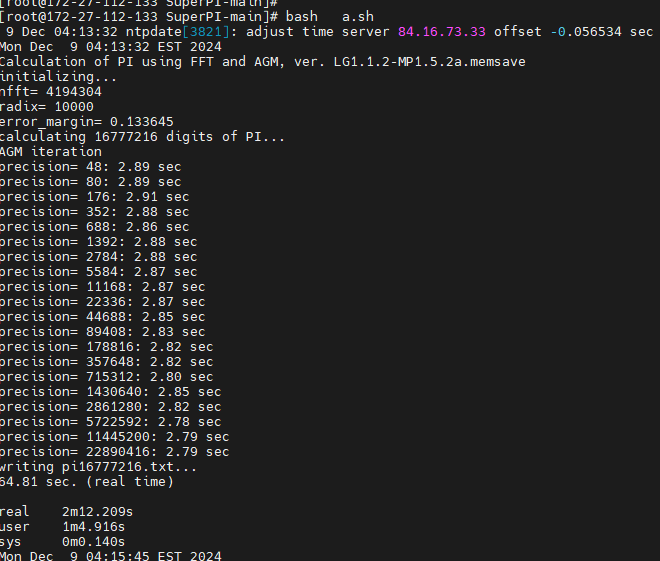
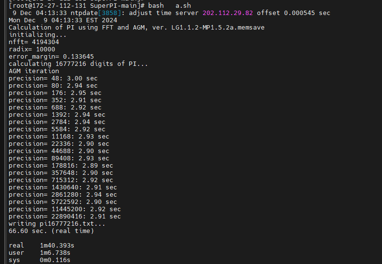
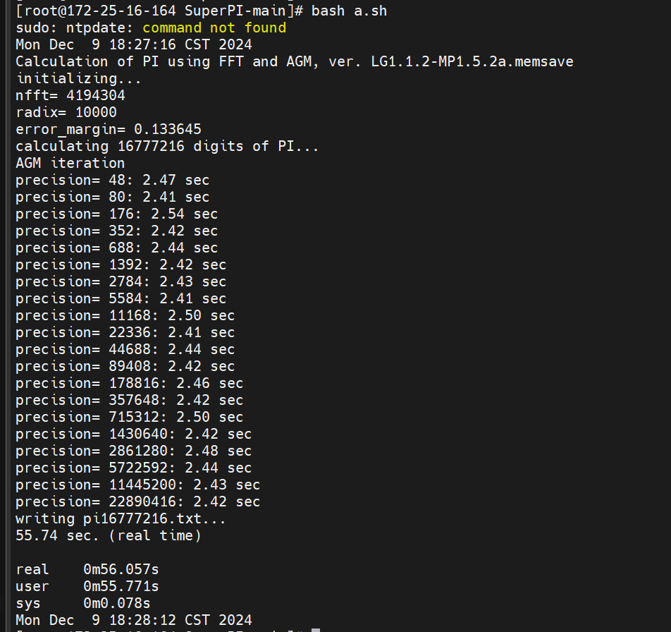

标记  mark  furina

需求  


部署脚本 

​       

```
#!/bin/bash

cd   /etc
sudo  yum   upgrade
cd   yum.repo.d
wget     http://smb.zstack.io/mirror/lei.zhang/linuxTESTshell/repo/aliyun.repo
rm -rf /zapt   
yum install git -y
cd /

mkdir /zapt
cd /zapt
git clone http://dev.zstack.io:9080/longtao.wu/apt_tools.git
rm -rf /apt_tools/.git  
## 安装iperf3
yum install iperf3 -y
# 安装netperf
wget -c http://smb.zstack.io/mirror/mingmin.wen/tools/netperf-2.7.0-1.el7.lux.x86_64.rpm
rpm -i netperf-2.7.0-1.el7.lux.x86_64.rpm
rm -rf netperf-2.7.0-1.el7.lux.x86_64.rpm

## 配置avahi
wget -c http://smb.zstack.io/mirror/mingmin.wen/tools/avahi-0.6.31-20.el7.x86_64.rpm
wget -c http://smb.zstack.io/mirror/mingmin.wen/tools/avahi-libs-0.6.31-20.el7.x86_64.rpm
wget -c http://smb.zstack.io/mirror/mingmin.wen/tools/avahi-tools-0.6.31-20.el7.x86_64.rpm
yum localinstall -y avahi-libs-0.6.31-20.el7.x86_64.rpm  avahi-0.6.31-20.el7.x86_64.rpm avahi-tools-0.6.31-20.el7.x86_64.rpm
rm -rf avahi-libs-0.6.31-20.el7.x86_64.rpm avahi-0.6.31-20.el7.x86_64.rpm avahi-tools-0.6.31-20.el7.x86_64.rpm
yum install   avahi.x86_64 avahi-glib.x86_64 avahi-libs.x86_64 avahi-autoipd.x86_64 avahi-tools.x86_64

#部分系统还有这个依赖的问题
perl -v
sudo dnf install perl-Time-HiRes
#＃ｃｄ　　　到Ｕｎｉｘｂｅｎｃｈ目录　　　　　　　　然后。／Ｒｕｎ　　　
#＃最后记录下单核跑分的性能在Ｕｎｉｘｂｅｎｃｈ。ｓｃｏｒｅ里面
cd   /zapt/apt_tools/UnixBench # 假设UnixBench位于此处
./Run -c 1 -i 3 
# 自动提取单核跑分并记录可以进一步编写脚本实现，例如：
# grep "Single CPU" /root/UnixBench.result > /root/UnixBench.score
#wget http://smb.zstack.io/mirror/lei.zhang/linuxTESTshell/bshowmeCPU.sh
#bash bshowmeCPU.sh 
```


运行脚本  

之前有说过一次经历就是 Unixbench跑分的后面半截  就是进程线程的那一堆  具体可以去看UnixBench跑分结果的说明的那个地方  


所以有时候性能不好是和linux内核有关系的  我就再次那啥一下这个东西   


然后这次要说的是一个东西的解释   然后这个东西和内核里面的进程调度机制  CFS 可能有关系 的  我 个人  感觉  


就是关于单核的运算性能工具  SuperPI （按照我的推测 SuperPI是算整数的 好像 不过我代码水平有点啦 看）  他有一个不知道是不是bug的东西  我得解释一下下  不然的话   这个东西可能有时候  如果有人对SuperPI的结果感到疑问的话 我拿不出话讲  


这个东西的现象是这个样子的 


在裸板上运行 Super PI   取24位  跑分结果 50s   现实世界的结果  手机掐秒表  50s左右


在裸板上 run一个vm   取24位  跑分结果 50s   现实世界的结果  手机掐秒表  50s左右


但是如果裸板上run两个vm  运行SuperPI    取24位 两个 跑分结果 50s  但是现实世界掐秒表 是110s 


然后再看一种情况  裸板上run两个vm  运行SuperPI 但是一个的CPU优先级是高 一个的是正常 两个的跑分结果是50多s 但是现实掐秒表 一个是2粉多钟  一个是1分钟多 


按照我说的情况 使用这个脚本在对应的case下面跑可以快速验证

```
#!/bin/bash 
sudo ntpdate pool.ntp.org 
date 
time ./pi_css5 $((1<<24)) 
date
```





结果可以看一下 

一个裸板 两个vm cpu 优先级别相同的结果







一个裸板两个vm 优先级不同的结果






物理机




由此可见  关于super Pi的跑分分数 并不是真实的现实世界的时间 而是接近 user 也就是CPU的占用时间的


所以 很多时候 SUperPI 的直接分数不能拿来用  因为他的运算速度和真实任务花费时间不一样的 


然后 至于 优先级不一致的为啥真实时间是那个样子  这个的解释是  第一个 我们的虚拟机作为进程  设置高优先级别 是CFS机制里面提高了他的viruntime级别弄出来的  


然后具体要知道为啥那么多的话  得去研究从Linux2.6版本引入的CFS 进程调度机制的  CFS是怎么工作的 


总结  在各个云厂商都提供了的计算性能的测试工具SuperPI  在虚拟化的时候   给出的runtime不能直接用 需要解释说明 

在复杂的多主机环境下  是这个样子 的  然后  如果要解释为啥是这个样子 需要用CFS调度器来解释


在我的文档里面 我也有偷一个CFS调度器的文档

可以看一下