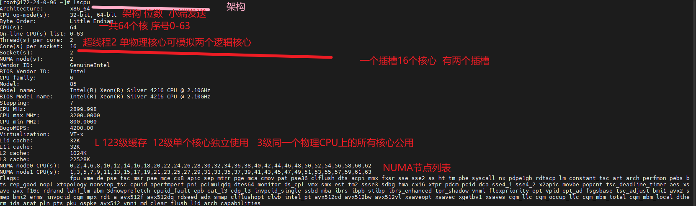
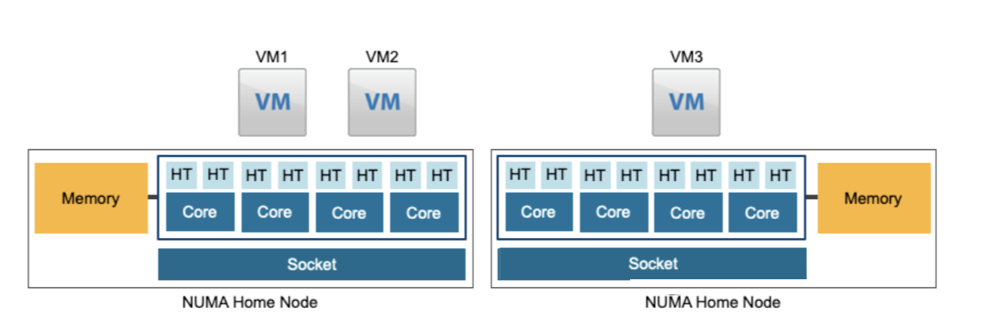

mark   furina 

### 机器上面的CPU相关

几个关于CPU调度的概念：

- socket：槽位，物理CPU的个数
- core：每个物理CPU的核心
- LCPU：逻辑CPU，也就是CPU的线程数，没有打开超线程下，LCPU=物理机总核心数
- vCPU：虚拟CPU数量，如果指定vSocket和VCore，vCPU = vSocket * vCore

在物理机上查看CPU lscpu

1. **Architecture**：
   - 显示系统架构，`x86_64` 表示这是一个 64 位系统。
2. **CPU op-mode(s)**：
   - 显示 CPU 支持的操作模式，`32-bit, 64-bit` 表示 CPU 支持 32 位和 64 位操作。
3. **Byte Order**：
   - 显示字节序，`Little Endian` 表示系统使用小端字节序。
4. **CPU(s)**：
   - 显示系统中的 CPU 核心总数。
5. **On-line CPU(s) list**：
   - 显示当前在线的 CPU 核心列表，`0-63` 表示核心编号从 0 到 63。
6. **Thread(s) per core**：
   - 显示每个核心上的线程数，`2` 表示每个核心有 2 个线程（超线程）。那意思就是 每个实际存在的物理核心可以干两个逻辑核心出来
7. **Core(s) per socket**：
   - 显示每个 CPU 插槽（socket）上的核心数，`16` 表示每个插槽有 16 个核心。
8. **Socket(s)**：
   - 显示系统中的 CPU 插槽数，`2` 表示有 2 个 CPU 插槽。
9. **NUMA node(s)**：
   - 显示系统中的 NUMA 节点数，`2` 表示有 2 个 NUMA 节点。
10. **Vendor ID**：
    - 显示 CPU 制造商的 ID，`GenuineIntel` 表示这是英特尔的 CPU。
11. **BIOS Vendor ID**：
    - 显示 BIOS 制造商的 ID。
12. **CPU family**：
    - 显示 CPU 系列编号。
13. **Model**：
    - 显示 CPU 型号编号。
14. **Model name**：
    - 显示 CPU 的完整型号名称。
15. **BIOS Model name**：
    - 显示 BIOS 中记录的 CPU 型号名称。
16. **Stepping**：
    - 显示 CPU 的步进版本号。
17. **CPU MHz**：
    - 显示 CPU 的当前运行频率。
18. **CPU max MHz**：
    - 显示 CPU 的最大运行频率。
19. **CPU min MHz**：
    - 显示 CPU 的最小运行频率。
20. **BogoMIPS**：
    - 显示 CPU 的性能指标，通常用于比较不同 CPU 的性能。
21. **Virtualization**：
    - 显示 CPU 是否支持虚拟化技术，`VT-x` 表示支持英特尔的虚拟化技术。
22. **L1d cache, L1i cache, L2 cache, L3 cache**：
    - 分别显示 CPU 的一级数据缓存、一级指令缓存、二级缓存和三级缓存的大小。  一级二级缓存 是 单个核心使用 三级缓存是一个真实的CPU上所有的核心一起用 
23. **NUMA node0 CPU(s), NUMA node1 CPU(s)**：
    - 显示属于 NUMA 节点 0 和 NUMA 节点 1 的 CPU 核心列表。
24. **Flags**：
    - 显示 CPU 支持的各种功能和指令集，如 `fpu`（浮点单元）、`vme`（虚拟模式扩展）、`sse`（流式 SIMD 指令集）、`avx`（高级向量扩展）等。

*当超分时，虚拟机所有vCPU之和超过物理总LCPU，Kernel调度器轮流调度vCPU，就会产生CPU资源争用，VM可能会在需要CPU时，获取不到，产生ready time，从而影响VM的CPU性能。*

在NUMA架构下，VM kernel会尽量保证虚拟机的vCPU运行在同一个物理NUMA节点，避免性能损失。

VM1、VM2在一个Node上，VM在一个Node上，性能最优。如果三个VM的vCPU或内存无法完全运行在主节点上，就需跨节点访问资源，从而影响性能。

vSphere 从5.5，支持vNUMA架构，在虚拟机级别启动NUMA。当满足以下两个条件时，vNUMA自动启动，否则需要手动修改参数启用：

- 虚拟机的vCPU >= 9 
- 虚拟机的vCPU超过一个物理节点的核心数（Core，不是LCPU）