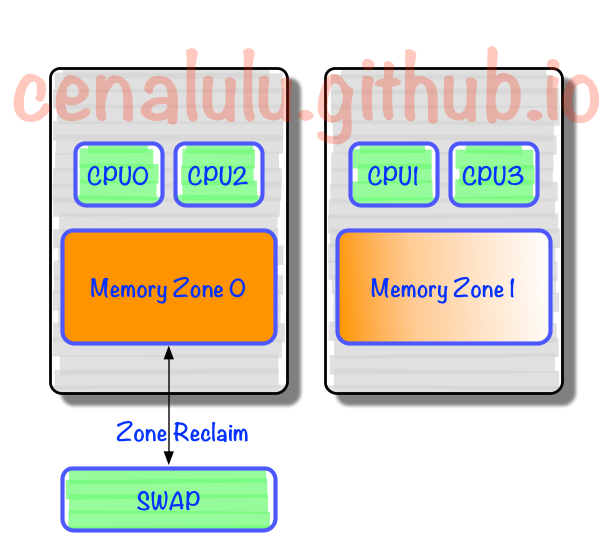
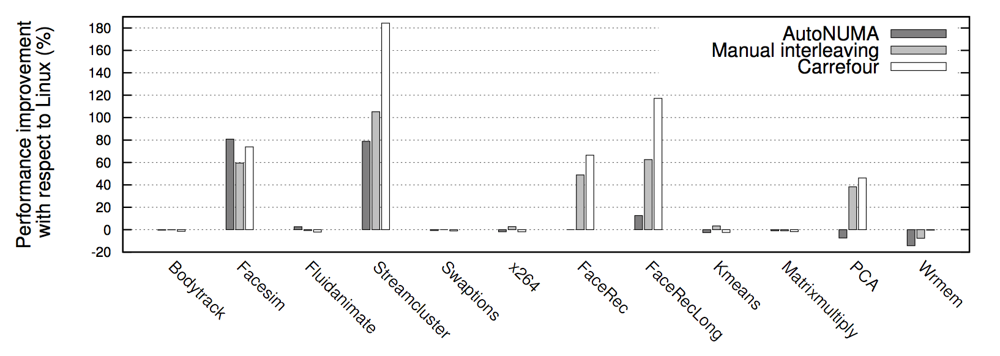

# NUMA架构的CPU -- 你真的用好了么？

> 本文从NUMA的介绍引出常见的NUMA使用中的陷阱，继而讨论对于NUMA系统的优化方法和一些值得关注的方向。

> 文章欢迎转载，但转载时请保留本段文字，并置于文章的顶部 作者：卢钧轶(cenalulu) 本文原文地址：http://cenalulu.github.io/linux/numa/

## NUMA简介

这部分将简要介绍下NUMA架构的成因和具体原理，已经了解的读者可以直接跳到第二节。

#### 为什么要有NUMA

在NUMA架构出现前，CPU欢快的朝着频率越来越高的方向发展。受到物理极限的挑战，又转为核数越来越多的方向发展。如果每个core的工作性质都是share-nothing（类似于map-reduce的node节点的作业属性），那么也许就不会有NUMA。由于所有CPU  Core都是通过共享一个北桥来读取内存，随着核数如何的发展，北桥在响应时间上的性能瓶颈越来越明显。于是，聪明的硬件设计师们，先到了把内存控制器（原本北桥中读取内存的部分）也做个拆分，平分到了每个die上。于是NUMA就出现了！

#### NUMA是什么

NUMA中，虽然内存直接attach在CPU上，但是由于内存被平均分配在了各个die上。只有当CPU访问自身直接attach内存对应的物理地址时，才会有较短的响应时间（后称`Local Access`）。而如果需要访问其他CPU attach的内存的数据时，就需要通过inter-connect通道访问，响应时间就相比之前变慢了（后称`Remote Access`）。所以NUMA（Non-Uniform Memory Access）就此得名。

#### 我们需要为NUMA做什么

假设你是Linux教父Linus，对于NUMA架构你会做哪些优化？下面这点是显而易见的：

> 既然CPU只有在Local-Access时响应时间才能有保障，那么我们就尽量把该CPU所要的数据集中在他local的内存中就OK啦~

没错，事实上Linux识别到NUMA架构后，默认的内存分配方案就是：优先尝试在请求线程当前所处的CPU的Local内存上分配空间。如果local内存不足，优先淘汰local内存中无用的Page（Inactive，Unmapped）。 那么，问题来了。。。

------

## NUMA的“七宗罪”

几乎所有的运维都会多多少少被NUMA坑害过，让我们看看究竟有多少种在NUMA上栽的方式：

- [MySQL – The MySQL “swap insanity” problem and the effects of the NUMA architecture](http://blog.jcole.us/2010/09/28/mysql-swap-insanity-and-the-numa-architecture/)
- [PostgreSQL – PostgreSQL, NUMA and zone reclaim mode on linux](http://frosty-postgres.blogspot.com/2012/08/postgresql-numa-and-zone-reclaim-mode.html)
- [Oracle – Non-Uniform Memory Access (NUMA) architecture with Oracle database by examples](http://blog.yannickjaquier.com/hpux/non-uniform-memory-access-numa-architecture-with-oracle-database-by-examples.html)
- [Java – Optimizing Linux Memory Management for Low-latency / High-throughput Databases](http://engineering.linkedin.com/performance/optimizing-linux-memory-management-low-latency-high-throughput-databases)

究其原因几乎都和：“因为CPU亲和策略导致的内存分配不平均”及“NUMA Zone Claim内存回收”有关，而和数据库种类并没有直接联系。所以下文我们就拿MySQL为例，来看看重内存操作应用在NUMA架构下到底会出现什么问题。

## MySQL在NUMA架构上会出现的问题

几乎所有`NUMA + MySQL`关键字的搜索结果都会指向：Jeremy Cole大神的两篇文章

- [The MySQL “swap insanity” problem and the effects of the NUMA architecture](http://blog.jcole.us/2010/09/28/mysql-swap-insanity-and-the-numa-architecture/)
- [A brief update on NUMA and MySQL](http://blog.jcole.us/2012/04/16/a-brief-update-on-numa-and-mysql/)

大神解释的非常详尽，有兴趣的读者可以直接看原文。博主这里做一个简单的总结：

- CPU规模因摩尔定律指数级发展，而总线发展缓慢，导致多核CPU通过一条总线共享内存成为瓶颈
- 于是NUMA出现了，CPU平均划分为若干个Chip（不多于4个），每个Chip有自己的内存控制器及内存插槽
- CPU访问自己Chip上所插的内存时速度快，而访问其他CPU所关联的内存（下文称Remote Access）的速度相较慢三倍左右
- 于是Linux内核默认使用CPU亲和的内存分配策略，使内存页尽可能的和调用线程处在同一个Core/Chip中
- 由于内存页没有动态调整策略，使得大部分内存页都集中在`CPU 0`上
- 又因为`Reclaim`默认策略优先淘汰/Swap本Chip上的内存，使得大量有用内存被换出
- 当被换出页被访问时问题就以数据库响应时间飙高甚至阻塞的形式出现了

## 解决方案

Jeremy Cole大神推荐的三个方案如下，如果想详细了解可以阅读 [原文](http://blog.jcole.us/2012/04/16/a-brief-update-on-numa-and-mysql/)

- `numactl --interleave=all`
- 在MySQL进程启动前，使用`sysctl -q -w vm.drop_caches=3`清空文件缓存所占用的空间
- Innodb在启动时，就完成整个`Innodb_buffer_pool_size`的内存分配

这三个方案也被业界普遍认可可行，同时在 [Twitter 的5.5patch](https://github.com/twitter/mysql/commit/19cf63c596c0146a72583998d138190cc285df5c) 和 [Percona 5.5 Improved NUMA Support](http://www.percona.com/doc/percona-server/5.5/performance/innodb_numa_support.html) 中作为功能被支持。

不过这种三合一的解决方案只是减少了NUMA内存分配不均，导致的MySQL SWAP问题出现的可能性。如果当系统上其他进程，或者MySQL本身需要大量内存时，Innodb Buffer  Pool的那些Page同样还是会被Swap到存储上。于是又在这基础上出现了另外几个进阶方案

- 配置`vm.zone_reclaim_mode = 0`使得内存不足时`去remote memory分配`优先于`swap out local page`
- `echo -15 > /proc/<pid_of_mysqld>/oom_adj`调低MySQL进程被`OOM_killer`强制Kill的可能
- [memlock](http://dev.mysql.com/doc/refman/5.6/en/server-options.html#option_mysqld_memlock)
- 对MySQL使用Huge Page（黑魔法，巧用了Huge Page不会被swap的特性）

## 重新审视问题

如果本文写到这里就这么结束了，那和搜索引擎结果中大量的Step-by-Step科普帖没什么差别。虽然我们用了各种参数调整减少了问题发生概率，那么真的就彻底解决了这个问题么？问题根源究竟是什么？让我们回过头来重新审视下这个问题：

#### NUMA Interleave真的好么？

**为什么`Interleave`的策略就解决了问题？** 借用两张 [Carrefour性能测试](https://www.cs.sfu.ca/~fedorova/papers/asplos284-dashti.pdf) 的结果图，可以看到几乎所有情况下`Interleave`模式下的程序性能都要比默认的亲和模式要高，有时甚至能高达30%。究其根本原因是Linux服务器的大多数workload分布都是随机的：即每个线程在处理各个外部请求对应的逻辑时，所需要访问的内存是在物理上随机分布的。而`Interleave`模式就恰恰是针对这种特性将内存page随机打散到各个CPU Core上，使得每个CPU的负载和`Remote Access`的出现频率都均匀分布。相较NUMA默认的内存分配模式，死板的把内存都优先分配在线程所在Core上的做法，显然普遍适用性要强很多。  

也就是说，像MySQL这种外部请求随机性强，各个线程访问内存在地址上平均分布的这种应用，`Interleave`的内存分配模式相较默认模式可以带来一定程度的性能提升。 此外 [各种](https://www.cs.sfu.ca/~fedorova/papers/asplos284-dashti.pdf) [论文](http://www.lst.inf.ethz.ch/people/alumni/zmajo/publications/11-systor.pdf) 中也都通过实验证实，真正造成程序在NUMA系统上性能瓶颈的并不是`Remote Acess`带来的响应时间损耗，而是内存的不合理分布导致`Remote Access`将inter-connect这个小水管塞满所造成的结果。而`Interleave`恰好，把这种不合理分布情况下的Remote Access请求平均分布在了各个小水管中。所以这也是`Interleave`效果奇佳的一个原因。

那是不是简简单单的配置个`Interleave`就已经把NUMA的特性和性能发挥到了极致呢？ 答案是否定的，目前Linux的内存分配机制在NUMA架构的CPU上还有一定的改进空间。例如：Dynamic Memory Loaction, Page Replication。

**Dynamic Memory Relocation** 我们来想一下这个情况：MySQL的线程分为两种，用户线程（SQL执行线程）和内部线程（内部功能，如：flush，io，master等）。对于用户线程来说随机性相当的强，但对于内部线程来说他们的行为以及所要访问的内存区域其实是相对固定且可以预测的。如果能对于这把这部分内存集中到这些内存线程所在的core上的时候，就能减少大量`Remote Access`，潜在的提升例如Page Flush，Purge等功能的吞吐量，甚至可以提高MySQL Crash后Recovery的速度（由于recovery是单线程）。 那是否能在`Interleave`模式下，把那些明显应该聚集在一个CPU上的内存集中在一起呢？ 很可惜，Dynamic Memory  Relocation这种技术目前只停留在理论和实验阶段。我们来看下难点：要做到按照线程的行为动态的调整page在memory的分布，就势必需要做线程和内存的实时监控（profile）。对于Memory Access这种非常异常频繁的底层操作来说增加profile入口的性能损耗是极大的。在 [关于CPU Cache程序应该知道的那些事](http://cenalulu.github.io/linux/all-about-cpu-cache/)的评论中我也提到过，这个道理和为什么Linux没有全局监控CPU L1/L2 Cache命中率工具的原因是一样的。当然优化不会就此停步。上文提到的[Carrefour算法](https://www.cs.sfu.ca/~fedorova/papers/asplos284-dashti.pdf)和Linux社区的`Auto NUMA patch`都是积极的尝试。什么时候内存profile出现硬件级别，类似于CPU中 [PMU](http://en.wikipedia.org/wiki/VTune) 的功能时，动态内存规划就会展现很大的价值，甚至会作为Linux Kernel的一个内部功能来实现。到那时我们再回过头来审视这个方案的实际价值。

**Page Replication** 再来看一下这些情况：一些动态加载的库，把他们放在任何一个线程所在的CPU都会导致其他CPU上线程的执行效率下降。而这些共享数据往往读写比非常高，如果能把这些数据的副本在每个Memory Zone内都放置一份，理论上会带来较大的性能提升，同时也减少在inter-connect上出现的瓶颈。实时上，仍然是上文提到的[Carrefour](https://www.cs.sfu.ca/~fedorova/papers/asplos284-dashti.pdf)也做了这样的尝试。由于缺乏硬件级别（如MESI协议的硬件支持）和操作系统原生级别的支持，Page  Replication在数据一致性上维护的成本显得比他带来的提升更多。因此这种尝试也仅仅停留在理论阶段。当然，如果能得到底层的大力支持，相信这个方案还是有极大的实际价值的。

#### 究竟是哪里出了问题

**NUMA的问题？** NUMA本身没有错，是CPU发展的一种必然趋势。但是NUMA的出现使得操作系统不得不关注内存访问速度不平均的问题。

**Linux Kernel内存分配策略的问题？** 分配策略的初衷是好的，为了内存更接近需要他的线程，但是没有考虑到数据库这种大规模内存使用的应用场景。同时缺乏动态调整的功能，使得这种悲剧在内存分配的那一刻就被买下了伏笔。

**数据库设计者不懂NUMA？** 数据库设计者也许从一开始就不会意识到NUMA的流行，或者甚至说提供一个透明稳定的内存访问是操作系统最基本的职责。那么在现状改变非常困难的情况下（下文会提到为什么困难）是不是作为内存使用者有义务更好的去理解使用NUMA？

#### 总结

其实无论是NUMA还是Linux Kernel，亦或是程序开发他们都没有错，只是还做得不够极致。如果NUMA在硬件级别可以提供更多低成本的profile接口；如果Linux  Kernel可以使用更科学的动态调整策略；如果程序开发人员更懂NUMA，那么我们完全可以更好的发挥NUMA的性能，使得无限横向扩展CPU核数不再是一个梦想。

- [Percona NUMA aware Configuration](http://www.percona.com/doc/percona-server/5.5/performance/innodb_numa_support.html)
- [Numa system performance issues – more than just swapping to consider](http://www.scalemysql.com/blog/2014/09/05/numa-system-performance-issues-more-than-just-swapping-to-consider/)
- [MySQL Server and NUMA architectures](http://mikaelronstrom.blogspot.com/2010/12/mysql-server-and-numa-architectures.html)
- [Checking /proc/pid/numa_maps can be dangerous for mysql client connections](http://blog.wl0.org/2012/09/checking-procnuma_maps-can-be-dangerous-for-mysql-client-connections/)
- [on swapping and kernels](http://dom.as/2014/01/17/on-swapping-and-kernels/)
- [Optimizing Linux Memory Management for Low-latency / High-throughput Databases](http://engineering.linkedin.com/performance/optimizing-linux-memory-management-low-latency-high-throughput-databases)
- [Memory System Performance in a NUMA Multicore Multiprocessor](http://www.lst.inf.ethz.ch/people/alumni/zmajo/publications/11-systor.pdf)
- [A Case for NUMA-aware Contention Management on Multicore Systems](http://www.sfu.ca/~sba70/files/atc11-blagodurov.pdf)