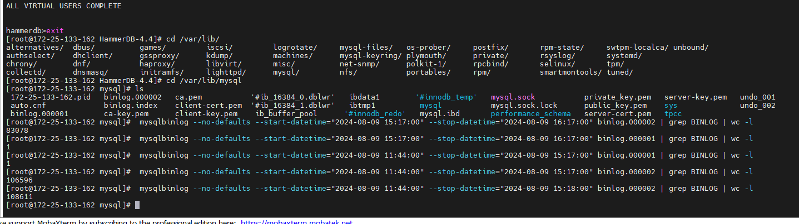

vsphere上  构建完数据库的时间  

hammerdb>exit
[root@localhost HammerDB-4.4]# date
Fri Aug  9 14:33:57 CST 2024
[root@localhost HammerDB-4.4]#

环境   

```
 mysqlbinlog --no-defaults --start-datetime="2024-08-09 11:44:00" --stop-datetime="2024-08-09 14:34:00" binlog.000002 | grep BINLOG | wc -l
```

```
 mysqlbinlog --no-defaults --start-datetime="2024-08-09 14:34:00" --stop-datetime="2024-08-09 15:14:00" binlog.000002 | grep BINLOG | wc -l
```


```
 mysqlbinlog --no-defaults --start-datetime="2024-08-09 11:44:00" --stop-datetime="2024-08-09 15:17:00" binlog.000001 | grep BINLOG | wc -l
```

```
 mysqlbinlog --no-defaults --start-datetime="2024-08-09 11:44:00" --stop-datetime="2024-08-09 15:18:00" binlog.000002 | grep BINLOG | wc -l
```

```
 mysqlbinlog --no-defaults --start-datetime="2024-08-09 15:17:00" --stop-datetime="2024-08-09 16:17:00" binlog.000002 | grep BINLOG | wc -l
```

```
 mysqlbinlog --no-defaults --start-datetime="2024-08-09 15:17:00" --stop-datetime="2024-08-09 16:17:00" binlog.000001 | grep BINLOG | wc -l
```




