reated by  张磊 on 十一月 22, 2024                        

------

- [路线图及交付时间](file:///E:/github/Confluence-space-export-082101-45.html/lei.zhang/182137013.html#id-复制从王载丰的2023年Q1云主机内核aio改进计划-路线图及交付时间)
- [aio 背景交代](file:///E:/github/Confluence-space-export-082101-45.html/lei.zhang/182137013.html#id-复制从王载丰的2023年Q1云主机内核aio改进计划-aio背景交代)
- [aio 原理分析](file:///E:/github/Confluence-space-export-082101-45.html/lei.zhang/182137013.html#id-复制从王载丰的2023年Q1云主机内核aio改进计划-aio原理分析)
- [aio 纸面收益](file:///E:/github/Confluence-space-export-082101-45.html/lei.zhang/182137013.html#id-复制从王载丰的2023年Q1云主机内核aio改进计划-aio纸面收益)
- [aio 实测收益](file:///E:/github/Confluence-space-export-082101-45.html/lei.zhang/182137013.html#id-复制从王载丰的2023年Q1云主机内核aio改进计划-aio实测收益)
- [aio 各方看法](file:///E:/github/Confluence-space-export-082101-45.html/lei.zhang/182137013.html#id-复制从王载丰的2023年Q1云主机内核aio改进计划-aio各方看法)
- [关于默认开启内核 aio 讨论](file:///E:/github/Confluence-space-export-082101-45.html/lei.zhang/182137013.html#id-复制从王载丰的2023年Q1云主机内核aio改进计划-关于默认开启内核aio讨论)

# 路线图及交付时间

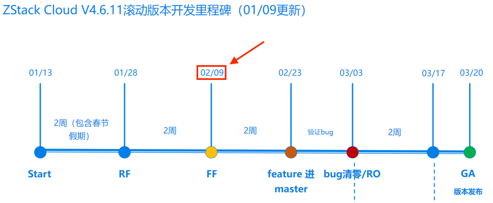

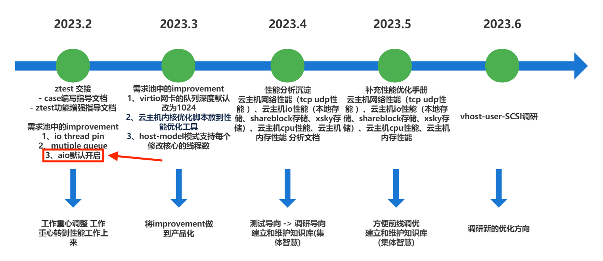

------

# aio 背景交代

**(一)** 什么是 aio **⬇**

aio 全称 "async I/O"，就是异步 I/O。

Linux 2.6 内核及以上版本，都提供了 aio 的支持。配合libaio库，即可以异步非阻塞模式访问 I/O。

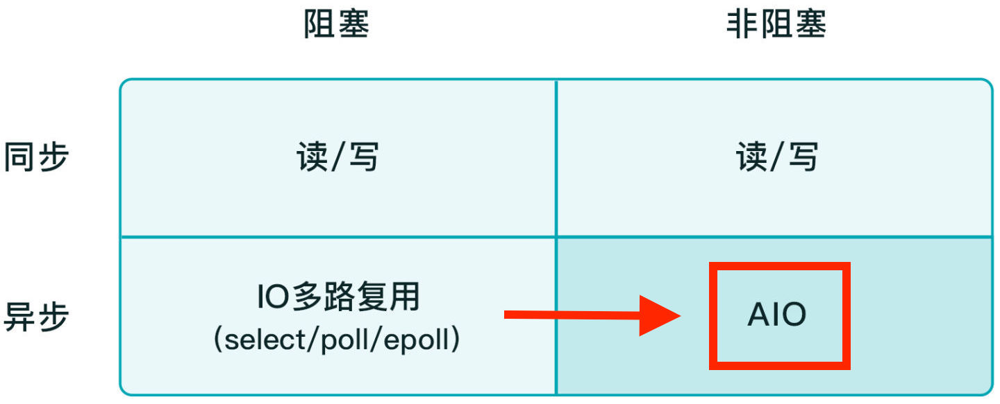

对于虚拟化存储而言, 调用内核 aio 的流程如下。

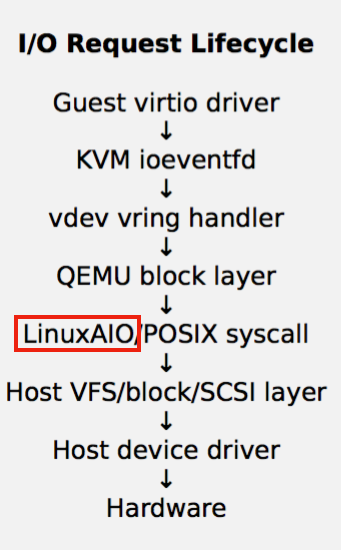

**(二)** 内核维护者 Linus Torvalds 对内核 aio 的看法 **⬇**

https://lwn.net/Articles/671649/

https://lwn.net/Articles/671657/

**(三)** Qemu I/O 模式 **⬇**

**https://lwn.net/Articles/671649/**

**https://access.redhat.com/documentation/en-us/red_hat_enterprise_linux/7/html/virtualization_tuning_and_optimization_guide/sect-virtualization_tuning_optimization_guide-blockio-io_mode**

| Qemu I/O 模式 | VM XML 区别   | 社区解释                                            |
| ------------- | ------------- | --------------------------------------------------- |
| native aio    | io=native'/>  | linux native libaio asynchronous block IO mechanism |
| threads       | io=threads'/> | spawns a pool of Qemu threads to handle requests    |

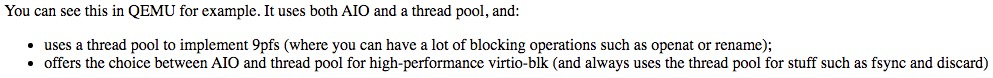

**(四)** 开启内核 aio 后, 具体 能带来 多少收益 **⬇**

对云主机IOPS有提升

1.参考 **redHat** 的数据 **[Storage-Performance-Tuning-for-FAST-Virtual-Machines_Fam-Zheng.pdf](file:///E:/github/Confluence-space-export-082101-45.html/lei.zhang/attachments/182137013/182137051.pdf)**

**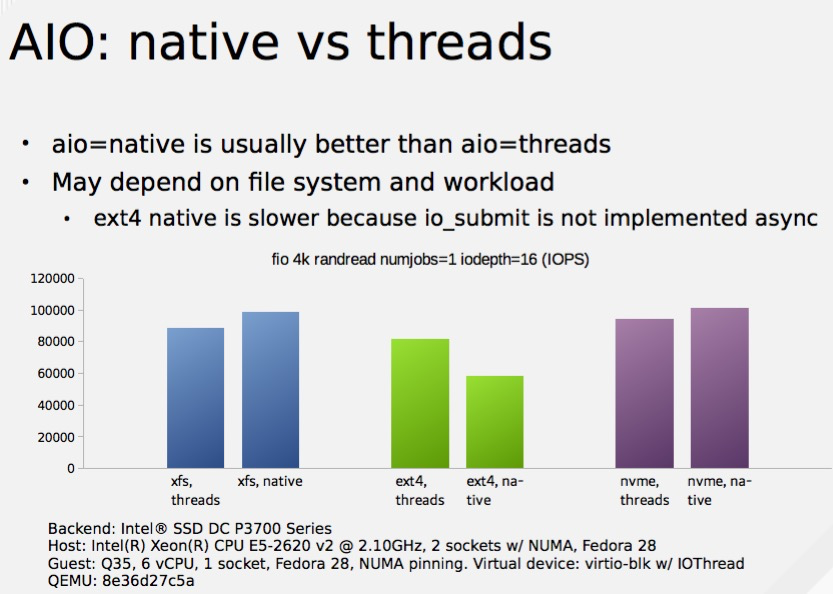**

2.参考 **国产化组** 实测数据                     [ZSTAC-13638](http://jira.zstack.io/browse/ZSTAC-13638?src=confmacro)                            -            ARM服务器上创建的vm测试FIO随机写的IOPS比物理机FIO随机写的IOPS小很多                                                Closed                

**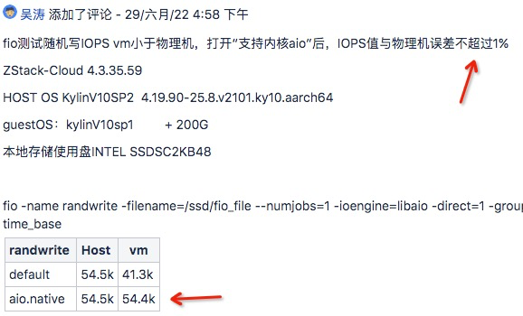**

**(五)** 怎么开启内核 aio **⬇**

使用时云主机缓存模式需设置为 "None"

关于缓存模式有什么区别, 可以参考如下图

| 缓存模式     | 描述                                 |
| ------------ | ------------------------------------ |
| writethrough | 数据完全落盘后，才返回成功           |
| none         | 直接访问存储，不带任何cache          |
| writeback    | 数据写入宿主机 pagecache，就返回成功 |

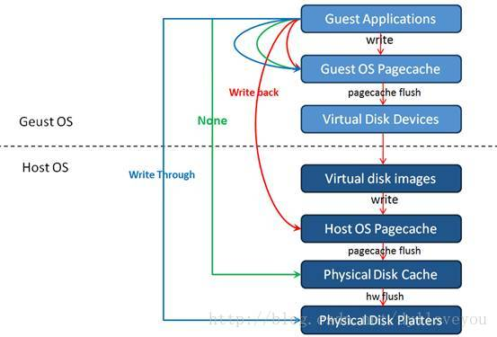

**(六)** 用或不用内核 aio，云主机的 XML 有何不同 **⬇**

**https://access.redhat.com/documentation/en-us/red_hat_enterprise_linux/7/html/virtualization_tuning_and_optimization_guide/sect-virtualization_tuning_optimization_guide-blockio-io_mode**

**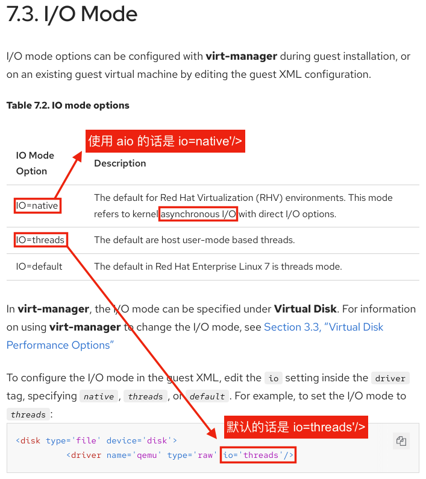**

**(七)** 你要做的东西，对应哪一个Jira **⬇**

​                    [ZSTAC-52475](http://jira.zstack.io/browse/ZSTAC-52475?src=confmacro)                            -            内核aio默认应该打开                                                Closed                

------

# aio 原理分析

**(一)** 为什么开启 aio 后对 “云主机 I/O 密集写场景” 有提升 **⬇**

云主机内应用程序发出 I/O写入请求之后, 会直接返回。
此时数据并没有真正落盘, 会先放入 I/O 队列中，等待写入。

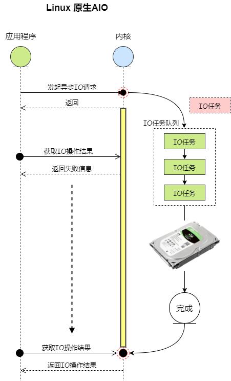
这种模型带来几个好处，一是应用并不会被某次IO请求阻塞，后续操作可以继续进行。
二是这种上下文切换很少，它可以在一个上下文完成多个IO的提交，减小了系统调用开销。

**(二)** 虚拟化存储栈中 aio 对应流程 **⬇**

数据先写入到 virtio ring buffer（virtqueue）中，合并后在提交到 aio 处理
“Requests are collected from the virtqueue and submitted (after write request merging) either via aio=threads or aio=native.”
“Request merging（I/O batch submission）handle more requests in one single system  call (io_submit), so calling number of the syscall of io_submit can be  decrease a lot.”
“virtio-blk does not merge read requests in qemu-kvm. It only merges write requests.”
”When Qemu virtio-blk handles requests, it can employ different IO mode. The  Qemu block drive option “aio=native” leverages Linux native libaio  asynchronous block IO mechanism to issue the requests to Linux kernel.“

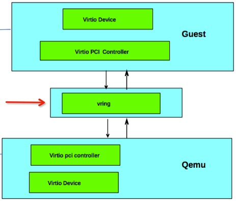

**(三)** 调研资料1：Intel 虚拟化调优指南, aio 配置相关从第 12 页开始 **⬇**

**(四)** 调研资料2：redhat 存储调优, aio 相关在第 48 页 **⬇**

****

**(五)** 调研资料3：redhat 比对分析 native（native aio）与 threads（默认同步io）**⬇**

**(六)** 调研资料4 ⬇

https://www.yanrongyun.com/zh-cn/blogs/how-to-improve-storage-performance-io-aio-model

**(七)** 调研资料5 ⬇

https://cloud.tencent.com/developer/article/1810604

**(八)** 调研资料6 ⬇

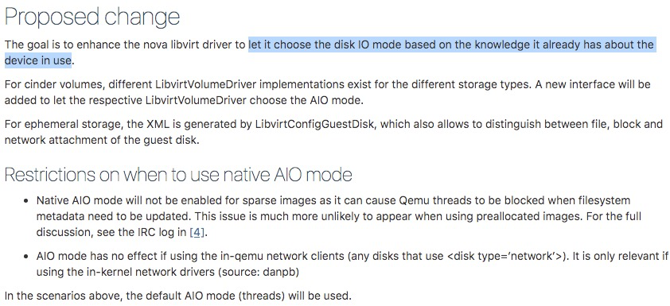

https://specs.openstack.org/openstack/nova-specs/specs/mitaka/implemented/libvirt-aio-mode.html

**(九)** 调研资料7 ⬇

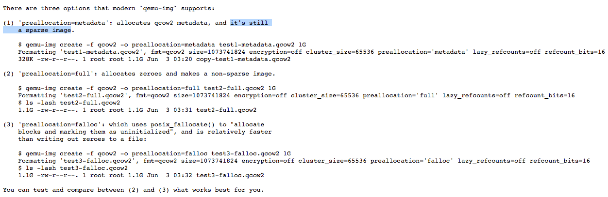

https://listman.redhat.com/archives/libvirt-users/2015-June/msg00009.html

------

# aio 纸面收益

**[qemu-disk-io-which-performs-better-native-or-threads.pdf](file:///E:/github/Confluence-space-export-082101-45.html/lei.zhang/attachments/182137013/182137066.pdf)**

**[Storage-Performance-Tuning-for-FAST-Virtual-Machines_Fam-Zheng.pdf](file:///E:/github/Confluence-space-export-082101-45.html/lei.zhang/attachments/182137013/182137051.pdf)**

**(一)** 总体收益 **⬇**

本地存储只要是 xfs 文件系统，开启内核 aio 后总体上 IOPS 会有提升

****

**(二) SSD存储** 不同场景下性能 **⬇**

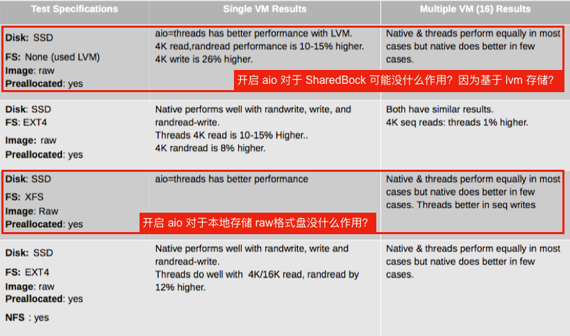

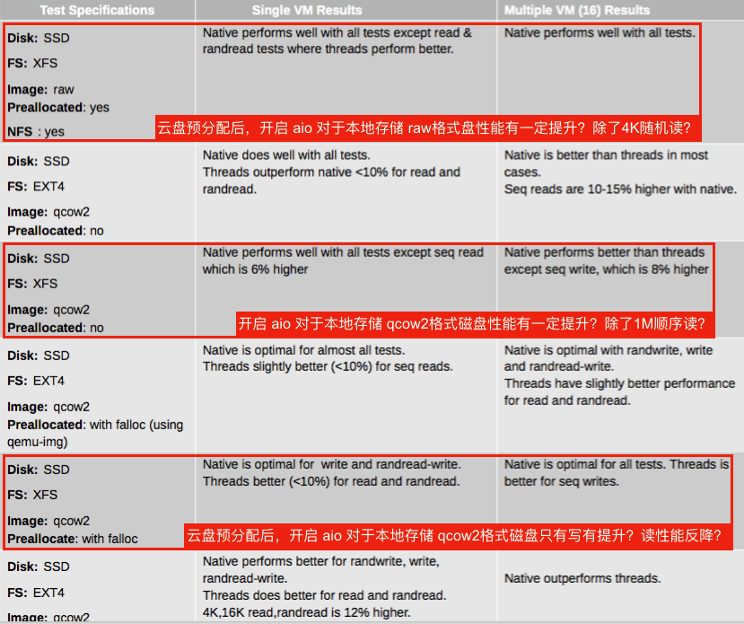

**(三) HDD存储** 不同场景下性能 **⬇**

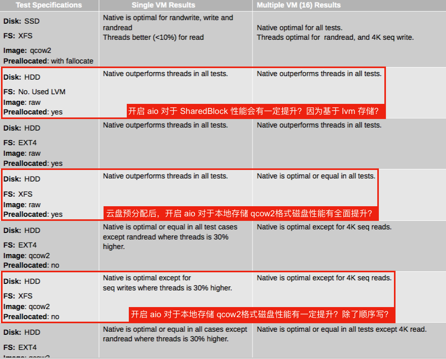

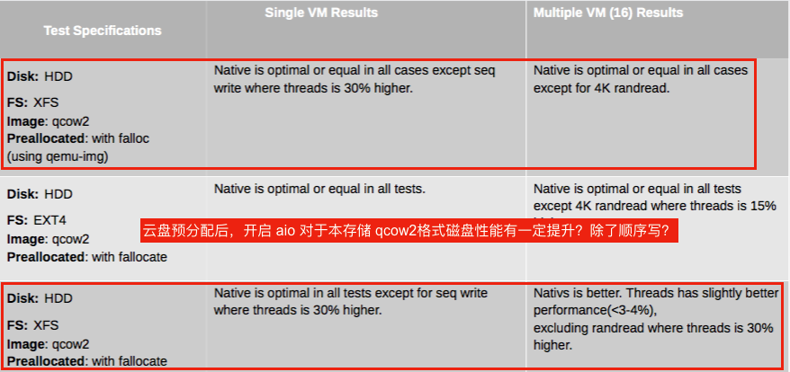

------

# aio 实测收益

**(一)** 测试范围及测试目的 **⬇**

1. **测试范围是** 比对 aio 开启前后针对不同条件变量下的性能差异。
2. **测试目的是** 验证 RedHat／OpenStack 文档中针对 aio 的论述，为特定条件下可默认打开 aio 策略补充依据（光有纸面数据不足以证明）。

**(二)** 测试总结 **⬇**

**(二)** 原始测试数据 **⬇**

|                         测试常量                         |                                                              |
| :------------------------------------------------------: | ------------------------------------------------------------ |
|                         文件系统                         | 固定 XFS                                                     |
|                         云盘容量                         | 固定 50G                                                     |
|                         缓存模式                         | none（默认）                                                 |
|                         测试命令                         | **fio -name mytest -rw=$mode -bs=4k -filename=$block -numjobs=1 -runtime=300 -iodepth=128 -size=50G -direct=1 -ioengine=libaio -time_based -group_reporting** |
| iodepth固定128、时间固定300秒、numjobs固定1、容量固定50G |                                                              |

| 主存储信息 |                                |
| :--------: | ------------------------------ |
|     UI     | 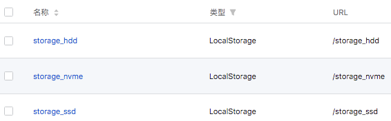 |
|   挂载点   | 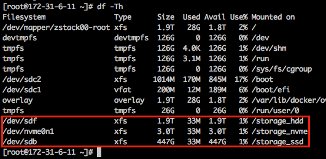 |

单云主机测试 **⬇**

|                           环境变量                           | 读写模型  |        结果        |                 |                |                  |          |        |                |
| :----------------------------------------------------------: | :-------: | :----------------: | --------------- | -------------- | ---------------- | -------- | ------ | -------------- |
|                           存储类型                           | 存储介质  | **已开启内核 aio** | I/O 抽象层      | 云盘预分配策略 | 云盘测试前写覆盖 | IOPS     | 延迟   |                |
|                         LocalStorage                         |    HDD    |       x 默认       | virtio-blk 默认 | none 默认      | x                | 4K随机读 | 299795 | 426.29 usec    |
|                         LocalStorage                         |    HDD    |       x 默认       | virtio-blk 默认 | none 默认      | x                | 4K随机写 | 558    | 228979.81 usec |
|                         LocalStorage                         |    HDD    |       x 默认       | virtio-blk 默认 | none 默认      | √                | 4K随机读 | 420    | 304 msec       |
|                         LocalStorage                         |    HDD    |       x 默认       | virtio-blk 默认 | none 默认      | √                | 4K随机写 | 553    | 231335.77 usec |
|                         LocalStorage                         |    HDD    |       x 默认       | virtio-blk 默认 | falloc         | x                | 4K随机读 | 146543 | 872.38 usec    |
|                         LocalStorage                         |    HDD    |       x 默认       | virtio-blk 默认 | falloc         | x                | 4K随机写 | 389    | 328.85 msec    |
|                         LocalStorage                         |    HDD    |       x 默认       | virtio-blk 默认 | falloc         | √                | 4K随机读 | 364    | 350.80 msec    |
|                         LocalStorage                         |    HDD    |       x 默认       | virtio-blk 默认 | falloc         | √                | 4K随机写 | 394    | 324.03 msec    |
|                         LocalStorage                         |    HDD    |       x 默认       | virtio-scsi     | none 默认      | x                | 4K随机读 | 216694 | 589.94 usec    |
|                         LocalStorage                         |    HDD    |       x 默认       | virtio-scsi     | none 默认      | x                | 4K随机写 | 559    | 228551.10 usec |
|                         LocalStorage                         |    HDD    |       x 默认       | virtio-scsi     | none 默认      | √                | 4K随机读 | 427    | 299.62 msec    |
|                         LocalStorage                         |    HDD    |       x 默认       | virtio-scsi     | none 默认      | √                | 4K随机写 | 565    | 226.17 msec    |
|                         LocalStorage                         |    HDD    |       x 默认       | virtio-scsi     | falloc         | x                | 4K随机读 | 133740 | 955.99 usec    |
|                         LocalStorage                         |    HDD    |       x 默认       | virtio-scsi     | falloc         | x                | 4K随机写 | 382    | 334.55 msec    |
|                         LocalStorage                         |    HDD    |       x 默认       | virtio-scsi     | falloc         | √                | 4K随机读 | 366    | 349.46 msec    |
|                         LocalStorage                         |    HDD    |       x 默认       | virtio-scsi     | falloc         | √                | 4K随机写 | 393    | 324.81 msec    |
|                         LocalStorage                         |    HDD    |         √          | virtio-blk 默认 | none 默认      | x                | 4K随机读 | 301093 | 424.45 usec    |
|                         LocalStorage                         |    HDD    |         √          | virtio-blk 默认 | none 默认      | x                | 4K随机写 | 539    | 237005.68 usec |
|                         LocalStorage                         |    HDD    |         √          | virtio-blk 默认 | none 默认      | √                | 4K随机读 | 402    | 317.61 msec    |
|                         LocalStorage                         |    HDD    |         √          | virtio-blk 默认 | none 默认      | √                | 4K随机写 | 551    | 232.13 msec    |
|                         LocalStorage                         |    HDD    |         √          | virtio-blk 默认 | falloc         | x                | 4K随机读 | 288679 | 442.72 usec    |
|                         LocalStorage                         |    HDD    |         √          | virtio-blk 默认 | falloc         | x                | 4K随机写 | 386    | 330.72 msec    |
|                         LocalStorage                         |    HDD    |         √          | virtio-blk 默认 | falloc         | √                | 4K随机读 | 366    | 348.80 msec    |
|                         LocalStorage                         |    HDD    |         √          | virtio-blk 默认 | falloc         | √                | 4K随机写 | 375    | 340.37 msec    |
|                         LocalStorage                         |    HDD    |         √          | virtio-scsi     | none 默认      | x                | 4K随机读 | 212706 | 601.03 usec    |
|                         LocalStorage                         |    HDD    |         √          | virtio-scsi     | none 默认      | x                | 4K随机写 | 571    | 223863.41 usec |
|                         LocalStorage                         |    HDD    |         √          | virtio-scsi     | none 默认      | √                | 4K随机读 | 391    | 326.74 msec    |
|                         LocalStorage                         |    HDD    |         √          | virtio-scsi     | none 默认      | √                | 4K随机写 | 552    | 231543.78 usec |
|                         LocalStorage                         |    HDD    |         √          | virtio-scsi     | falloc         | x                | 4K随机读 | 182730 | 699.73 usec    |
|                         LocalStorage                         |    HDD    |         √          | virtio-scsi     | falloc         | x                | 4K随机写 | 400    | 319.32 msec    |
|                         LocalStorage                         |    HDD    |         √          | virtio-scsi     | falloc         | √                | 4K随机读 | 390    | 327.98 msec    |
|                         LocalStorage                         |    HDD    |         √          | virtio-scsi     | falloc         | √                | 4K随机写 | 390    | 327910.17 usec |
|                         LocalStorage                         |    SSD    |       x 默认       | virtio-blk 默认 | none 默认      | x                | 4K随机读 | 311695 | 410.03 usec    |
|                         LocalStorage                         |    SSD    |       x 默认       | virtio-blk 默认 | none 默认      | x                | 4K随机写 | 31336  | 4083.38 usec   |
|                         LocalStorage                         |    SSD    |       x 默认       | virtio-blk 默认 | none 默认      | √                | 4K随机读 | 82001  | 1559.79 usec   |
|                         LocalStorage                         |    SSD    |       x 默认       | virtio-blk 默认 | none 默认      | √                | 4K随机写 | 65902  | 1941.20 usec   |
|                         LocalStorage                         |    SSD    |       x 默认       | virtio-blk 默认 | falloc         | x                | 4K随机读 | 144347 | 885.78 usec    |
|                         LocalStorage                         |    SSD    |       x 默认       | virtio-blk 默认 | falloc         | x                | 4K随机写 | 37684  | 3395.45 usec   |
|                         LocalStorage                         |    SSD    |       x 默认       | virtio-blk 默认 | falloc         | √                | 4K随机读 | 81967  | 1560.42 usec   |
|                         LocalStorage                         |    SSD    |       x 默认       | virtio-blk 默认 | falloc         | √                | 4K随机写 | 65740  | 1946.01 usec   |
|                         LocalStorage                         |    SSD    |       x 默认       | virtio-scsi     | none 默认      | x                | 4K随机读 | 211601 | 604.15 usec    |
|                         LocalStorage                         |    SSD    |       x 默认       | virtio-scsi     | none 默认      | x                | 4K随机写 | 31335  | 4083.23 usec   |
|                         LocalStorage                         |    SSD    |       x 默认       | virtio-scsi     | none 默认      | √                | 4K随机读 | 69629  | 1837.01 usec   |
|                         LocalStorage                         |    SSD    |       x 默认       | virtio-scsi     | none 默认      | √                | 4K随机写 | 65913  | 1940.61 usec   |
|                         LocalStorage                         |    SSD    |       x 默认       | virtio-scsi     | falloc         | x                | 4K随机读 | 128489 | 995.00 usec    |
|                         LocalStorage                         |    SSD    |       x 默认       | virtio-scsi     | falloc         | x                | 4K随机写 | 36490  | 3506.31 usec   |
|                         LocalStorage                         |    SSD    |       x 默认       | virtio-scsi     | falloc         | √                | 4K随机读 | 81812  | 1563.24 usec   |
|                         LocalStorage                         |    SSD    |       x 默认       | virtio-scsi     | falloc         | √                | 4K随机写 | 65842  | 1942.74 usec   |
|                         LocalStorage                         |    SSD    |         √          | virtio-blk 默认 | none 默认      | x                | 4K随机读 | 304424 | 419.77 usec    |
|                         LocalStorage                         |    SSD    |         √          | virtio-blk 默认 | none 默认      | x                | 4K随机写 | 36213  | 3533.60 usec   |
|                         LocalStorage                         |    SSD    |         √          | virtio-blk 默认 | none 默认      | √                | 4K随机读 | 81613  | 1567.54 usec   |
|                         LocalStorage                         |    SSD    |         √          | virtio-blk 默认 | none 默认      | √                | 4K随机写 | 67266  | 1902.03 usec   |
|                         LocalStorage                         |    SSD    |         √          | virtio-blk 默认 | falloc         | x                | 4K随机读 | 300654 | 425.06 usec    |
|                         LocalStorage                         |    SSD    |         √          | virtio-blk 默认 | falloc         | x                | 4K随机写 | 42598  | 3003.72 usec   |
|                         LocalStorage                         |    SSD    |         √          | virtio-blk 默认 | falloc         | √                | 4K随机读 | 82114  | 1558.10 usec   |
|                         LocalStorage                         |    SSD    |         √          | virtio-blk 默认 | falloc         | √                | 4K随机写 | 65766  | 1945.41 usec   |
|                         LocalStorage                         |    SSD    |         √          | virtio-scsi     | none 默认      | x                | 4K随机读 | 216840 | 589.54 usec    |
|                         LocalStorage                         |    SSD    |         √          | virtio-scsi     | none 默认      | x                | 4K随机写 | 36119  | 3542.79 usec   |
|                         LocalStorage                         |    SSD    |         √          | virtio-scsi     | none 默认      | √                | 4K随机读 | 81915  | 1561.73 usec   |
|                         LocalStorage                         |    SSD    |         √          | virtio-scsi     | none 默认      | √                | 4K随机写 | 66065  | 1936.38 usec   |
|                         LocalStorage                         |    SSD    |         √          | virtio-scsi     | falloc         | x                | 4K随机读 | 182796 | 699.47 usec    |
|                         LocalStorage                         |    SSD    |         √          | virtio-scsi     | falloc         | x                | 4K随机写 | 44330  | 2886.30 usec   |
|                         LocalStorage                         |    SSD    |         √          | virtio-scsi     | falloc         | √                | 4K随机读 | 82080  | 1558.54 usec   |
|                         LocalStorage                         |    SSD    |         √          | virtio-scsi     | falloc         | √                | 4K随机写 | 66225  | 1931.76 usec   |
|                         LocalStorage                         |   NVME    |       x 默认       | virtio-blk 默认 | none 默认      | x                | 4K随机读 | 304152 | 420.14 usec    |
|                         LocalStorage                         |   NVME    |       x 默认       | virtio-blk 默认 | none 默认      | x                | 4K随机写 | 34187  | 3742.76 usec   |
|                         LocalStorage                         |   NVME    |       x 默认       | virtio-blk 默认 | none 默认      | √                | 4K随机读 | 133740 | 955.91 usec    |
|                         LocalStorage                         |   NVME    |       x 默认       | virtio-blk 默认 | none 默认      | √                | 4K随机写 | 134442 | 950.98 usec    |
|                         LocalStorage                         |   NVME    |       x 默认       | virtio-blk 默认 | falloc         | x                | 4K随机读 | 138927 | 920.25 usec    |
|                         LocalStorage                         |   NVME    |       x 默认       | virtio-blk 默认 | falloc         | x                | 4K随机写 | 38802  | 3297.71 usec   |
|                         LocalStorage                         |   NVME    |       x 默认       | virtio-blk 默认 | falloc         | √                | 4K随机读 | 143403 | 891.47 usec    |
|                         LocalStorage                         |   NVME    |       x 默认       | virtio-blk 默认 | falloc         | √                | 4K随机写 | 140326 | 911.08 usec    |
|                         LocalStorage                         |   NVME    |       x 默认       | virtio-scsi     | none 默认      | x                | 4K随机读 | 209850 | 609.18 usec    |
|                         LocalStorage                         |   NVME    |       x 默认       | virtio-scsi     | none 默认      | x                | 4K随机写 | 34964  | 3659.59 usec   |
|                         LocalStorage                         |   NVME    |       x 默认       | virtio-scsi     | none 默认      | √                | 4K随机读 | 125008 | 1022.77 usec   |
|                         LocalStorage                         |   NVME    |       x 默认       | virtio-scsi     | none 默认      | √                | 4K随机写 | 118603 | 1077.95 usec   |
|                         LocalStorage                         |   NVME    |       x 默认       | virtio-scsi     | falloc         | x                | 4K随机读 | 134674 | 949.36 usec    |
|                         LocalStorage                         |   NVME    |       x 默认       | virtio-scsi     | falloc         | x                | 4K随机写 | 39113  | 3271.33 usec   |
|                         LocalStorage                         |   NVME    |       x 默认       | virtio-scsi     | falloc         | √                | 4K随机读 | 133211 | 959.61 usec    |
|                         LocalStorage                         |   NVME    |       x 默认       | virtio-scsi     | falloc         | √                | 4K随机写 | 119228 | 1072.40 usec   |
|                         LocalStorage                         |   NVME    |         √          | virtio-blk 默认 | none 默认      | x                | 4K随机读 | 304467 | 419.70 usec    |
|                         LocalStorage                         |   NVME    |         √          | virtio-blk 默认 | none 默认      | x                | 4K随机写 | 33478  | 3822.31 usec   |
|                         LocalStorage                         |   NVME    |         √          | virtio-blk 默认 | none 默认      | √                | 4K随机读 | 216143 | 591.47 usec    |
|                         LocalStorage                         |   NVME    |         √          | virtio-blk 默认 | none 默认      | √                | 4K随机写 | 142240 | 899.07 usec    |
|                         LocalStorage                         |   NVME    |         √          | virtio-blk 默认 | falloc         | x                | 4K随机读 | 290735 | 439.52 usec    |
|                         LocalStorage                         |   NVME    |         √          | virtio-blk 默认 | falloc         | x                | 4K随机写 | 46378  | 2758.88 usec   |
|                         LocalStorage                         |   NVME    |         √          | virtio-blk 默认 | falloc         | √                | 4K随机读 | 212038 | 602.89 usec    |
|                         LocalStorage                         |   NVME    |         √          | virtio-blk 默认 | falloc         | √                | 4K随机写 | 146197 | 874.76 usec    |
|                         LocalStorage                         |   NVME    |         √          | virtio-scsi     | none 默认      | x                | 4K随机读 | 211151 | 605.46 usec    |
|                         LocalStorage                         |   NVME    |         √          | virtio-scsi     | none 默认      | x                | 4K随机写 | 33284  | 3844.45 usec   |
|                         LocalStorage                         |   NVME    |         √          | virtio-scsi     | none 默认      | √                | 4K随机读 | 149089 | 857.77 usec    |
|                         LocalStorage                         |   NVME    |         √          | virtio-scsi     | none 默认      | √                | 4K随机写 | 115188 | 1110.39 usec   |
|                         LocalStorage                         |   NVME    |         √          | virtio-scsi     | falloc         | x                | 4K随机读 | 200243 | 638.56 usec    |
|                         LocalStorage                         |   NVME    |         √          | virtio-scsi     | falloc         | x                | 4K随机写 | 45447  | 2815.25 usec   |
|                         LocalStorage                         |   NVME    |         √          | virtio-scsi     | falloc         | √                | 4K随机读 | 164347 | 777.96 usec    |
|                         LocalStorage                         |   NVME    |         √          | virtio-scsi     | falloc         | √                | 4K随机写 | 118310 | 1081.05 usec   |
|                                                              |           |                    |                 |                |                  |          |        |                |
|                         SharedBlock                          |    HDD    |       x 默认       | virtio-blk 默认 | ／             | x                | 4K随机读 |        |                |
|                         SharedBlock                          |    HDD    |       x 默认       | virtio-blk 默认 | ／             | x                | 4K随机写 |        |                |
|                         SharedBlock                          |    HDD    |       x 默认       | virtio-blk 默认 | ／             | √                | 4K随机读 |        |                |
|                         SharedBlock                          |    HDD    |       x 默认       | virtio-blk 默认 | ／             | √                | 4K随机写 |        |                |
|                         SharedBlock                          |    HDD    |       x 默认       | virtio-scsi     | ／             | x                | 4K随机读 |        |                |
|                         SharedBlock                          |    HDD    |       x 默认       | virtio-scsi     | ／             | x                | 4K随机写 |        |                |
|                         SharedBlock                          |    HDD    |       x 默认       | virtio-scsi     | ／             | √                | 4K随机读 |        |                |
|                         SharedBlock                          |    HDD    |       x 默认       | virtio-scsi     | ／             | √                | 4K随机写 |        |                |
|                         SharedBlock                          |    HDD    |         √          | virtio-blk 默认 | ／             | x                | 4K随机读 |        |                |
|                         SharedBlock                          |    HDD    |         √          | virtio-blk 默认 | ／             | x                | 4K随机写 |        |                |
|                         SharedBlock                          |    HDD    |         √          | virtio-blk 默认 | ／             | √                | 4K随机读 |        |                |
|                         SharedBlock                          |    HDD    |         √          | virtio-blk 默认 | ／             | √                | 4K随机写 |        |                |
|                         SharedBlock                          |    HDD    |         √          | virtio-scsi     | ／             | x                | 4K随机读 |        |                |
|                         SharedBlock                          |    HDD    |         √          | virtio-scsi     | ／             | x                | 4K随机写 |        |                |
|                         SharedBlock                          |    HDD    |         √          | virtio-scsi     | ／             | √                | 4K随机读 |        |                |
|                         SharedBlock                          |    HDD    |         √          | virtio-scsi     | ／             | √                | 4K随机写 |        |                |
| 这块SSD在物理机直接测 LV 的话，4K随机写是 62.0k IOPS，在开启 aio 后，云主机数据与物理机较接近 **⬇** |           |                    |                 |                |                  |          |        |                |
|                         SharedBlock                          | SSD-iSCSI |       x 默认       | virtio-blk 默认 | ／             | x                | 4K随机读 | 43164  | 2964.31 usec   |
|                         SharedBlock                          | SSD-iSCSI |       x 默认       | virtio-blk 默认 | ／             | x                | 4K随机写 | 54564  | 2344.82 usec   |
|                         SharedBlock                          | SSD-iSCSI |       x 默认       | virtio-blk 默认 | ／             | √                | 4K随机读 | 46128  | 2773.90 usec   |
|                         SharedBlock                          | SSD-iSCSI |       x 默认       | virtio-blk 默认 | ／             | √                | 4K随机写 | 53981  | 2370.05 usec   |
|                         SharedBlock                          | SSD-iSCSI |       x 默认       | virtio-scsi     | ／             | x                | 4K随机读 | 43809  | 2920.50 usec   |
|                         SharedBlock                          | SSD-iSCSI |       x 默认       | virtio-scsi     | ／             | x                | 4K随机写 | 52117  | 2454.58 usec   |
|                         SharedBlock                          | SSD-iSCSI |       x 默认       | virtio-scsi     | ／             | √                | 4K随机读 | 43300  | 2954.89 usec   |
|                         SharedBlock                          | SSD-iSCSI |       x 默认       | virtio-scsi     | ／             | √                | 4K随机写 | 52177  | 2451.72 usec   |
|                         SharedBlock                          | SSD-iSCSI |         √          | virtio-blk 默认 | ／             | x                | 4K随机读 | 46425  | 2756.26 usec   |
|                         SharedBlock                          | SSD-iSCSI |         √          | virtio-blk 默认 | ／             | x                | 4K随机写 | 58718  | 2179.16 usec   |
|                         SharedBlock                          | SSD-iSCSI |         √          | virtio-blk 默认 | ／             | √                | 4K随机读 | 44845  | 2853.42 usec   |
|                         SharedBlock                          | SSD-iSCSI |         √          | virtio-blk 默认 | ／             | √                | 4K随机写 | 59016  | 2168.19 usec   |
|                         SharedBlock                          | SSD-iSCSI |         √          | virtio-scsi     | ／             | x                | 4K随机读 | 49958  | 2561.17 usec   |
|                         SharedBlock                          | SSD-iSCSI |         √          | virtio-scsi     | ／             | x                | 4K随机写 | 59420  | 2153.30 usec   |
|                         SharedBlock                          | SSD-iSCSI |         √          | virtio-scsi     | ／             | √                | 4K随机读 | 47457  | 2696.18 usec   |
|                         SharedBlock                          | SSD-iSCSI |         √          | virtio-scsi     | ／             | √                | 4K随机写 | 58745  | 2178.07 usec   |
|                         SharedBlock                          |   NVME    |       x 默认       | virtio-blk 默认 | ／             | x                | 4K随机读 |        |                |
|                         SharedBlock                          |   NVME    |       x 默认       | virtio-blk 默认 | ／             | x                | 4K随机写 |        |                |
|                         SharedBlock                          |   NVME    |       x 默认       | virtio-blk 默认 | ／             | √                | 4K随机读 |        |                |
|                         SharedBlock                          |   NVME    |       x 默认       | virtio-blk 默认 | ／             | √                | 4K随机写 |        |                |
|                         SharedBlock                          |   NVME    |       x 默认       | virtio-scsi     | ／             | x                | 4K随机读 |        |                |
|                         SharedBlock                          |   NVME    |       x 默认       | virtio-scsi     | ／             | x                | 4K随机写 |        |                |
|                         SharedBlock                          |   NVME    |       x 默认       | virtio-scsi     | ／             | √                | 4K随机读 |        |                |
|                         SharedBlock                          |   NVME    |       x 默认       | virtio-scsi     | ／             | √                | 4K随机写 |        |                |
|                         SharedBlock                          |   NVME    |         √          | virtio-blk 默认 | ／             | x                | 4K随机读 |        |                |
|                         SharedBlock                          |   NVME    |         √          | virtio-blk 默认 | ／             | x                | 4K随机写 |        |                |
|                         SharedBlock                          |   NVME    |         √          | virtio-blk 默认 | ／             | √                | 4K随机读 |        |                |
|                         SharedBlock                          |   NVME    |         √          | virtio-blk 默认 | ／             | √                | 4K随机写 |        |                |
|                         SharedBlock                          |   NVME    |         √          | virtio-scsi     | ／             | x                | 4K随机读 |        |                |
|                         SharedBlock                          |   NVME    |         √          | virtio-scsi     | ／             | x                | 4K随机写 |        |                |
|                         SharedBlock                          |   NVME    |         √          | virtio-scsi     | ／             | √                | 4K随机读 |        |                |
|                         SharedBlock                          |   NVME    |         √          | virtio-scsi     | ／             | √                | 4K随机写 |        |                |
| 该 FC-SAN（DELL EMC 存储）在物理机直接测 LV 的话，4K随机写是 5066 IOPS，以下是云主机的性能数据 **⬇** |           |                    |                 |                |                  |          |        |                |
|                         SharedBlock                          |  FC-SAN   |       x 默认       | virtio-blk 默认 | ／             | x                | 4K随机读 | 171816 | 743.97 msec    |
|                         SharedBlock                          |  FC-SAN   |       x 默认       | virtio-blk 默认 | ／             | x                | 4K随机写 | 1579   | 81.01 msec     |
|                         SharedBlock                          |  FC-SAN   |       x 默认       | virtio-blk 默认 | ／             | √                | 4K随机读 | 3090   | 41.41 msec     |
|                         SharedBlock                          |  FC-SAN   |       x 默认       | virtio-blk 默认 | ／             | √                | 4K随机写 | 4045   | 31638.77 usec  |
|                         SharedBlock                          |  FC-SAN   |       x 默认       | virtio-scsi     | ／             | x                | 4K随机读 | 130006 | 983.63 usec    |
|                         SharedBlock                          |  FC-SAN   |       x 默认       | virtio-scsi     | ／             | x                | 4K随机写 | 1474   | 86.83 msec     |
|                         SharedBlock                          |  FC-SAN   |       x 默认       | virtio-scsi     | ／             | √                | 4K随机读 | 3095   | 41.34 msec     |
|                         SharedBlock                          |  FC-SAN   |       x 默认       | virtio-scsi     | ／             | √                | 4K随机写 | 3727   | 34341.67 usec  |
|                         SharedBlock                          |  FC-SAN   |         √          | virtio-blk 默认 | ／             | x                | 4K随机读 | 5924   | 21602.54 usec  |
|                         SharedBlock                          |  FC-SAN   |         √          | virtio-blk 默认 | ／             | x                | 4K随机写 | 916    | 139685.08 usec |
|                         SharedBlock                          |  FC-SAN   |         √          | virtio-blk 默认 | ／             | √                | 4K随机读 | 3056   | 41874.59 usec  |
|                         SharedBlock                          |  FC-SAN   |         √          | virtio-blk 默认 | ／             | √                | 4K随机写 | 5184   | 24688.27 usec  |
|                         SharedBlock                          |  FC-SAN   |         √          | virtio-scsi     | ／             | x                | 4K随机读 | 143839 | 889.15 usec    |
|                         SharedBlock                          |  FC-SAN   |         √          | virtio-scsi     | ／             | x                | 4K随机写 | 1104   | 115855.01 usec |
|                         SharedBlock                          |  FC-SAN   |         √          | virtio-scsi     | ／             | √                | 4K随机读 | 3094   | 41.36 msec     |
|                         SharedBlock                          |  FC-SAN   |         √          | virtio-scsi     | ／             | √                | 4K随机写 | 4106   | 31171.98 usec  |
| 该 IP-SAN（曙光 XStor 存储）在物理机直接测 LV 的话，4K随机写是 xxxx IOPS，以下是云主机的性能数据 **⬇** |           |                    |                 |                |                  |          |        |                |
|                         SharedBlock                          |  IP-SAN   |       x 默认       | virtio-blk 默认 | ／             | x                | 4K随机读 |        |                |
|                         SharedBlock                          |  IP-SAN   |       x 默认       | virtio-blk 默认 | ／             | x                | 4K随机写 |        |                |
|                         SharedBlock                          |  IP-SAN   |       x 默认       | virtio-blk 默认 | ／             | √                | 4K随机读 |        |                |
|                         SharedBlock                          |  IP-SAN   |       x 默认       | virtio-blk 默认 | ／             | √                | 4K随机写 |        |                |
|                         SharedBlock                          |  IP-SAN   |       x 默认       | virtio-scsi     | ／             | x                | 4K随机读 |        |                |
|                         SharedBlock                          |  IP-SAN   |       x 默认       | virtio-scsi     | ／             | x                | 4K随机写 |        |                |
|                         SharedBlock                          |  IP-SAN   |       x 默认       | virtio-scsi     | ／             | √                | 4K随机读 |        |                |
|                         SharedBlock                          |  IP-SAN   |       x 默认       | virtio-scsi     | ／             | √                | 4K随机写 |        |                |
|                         SharedBlock                          |  IP-SAN   |         √          | virtio-blk 默认 | ／             | x                | 4K随机读 |        |                |
|                         SharedBlock                          |  IP-SAN   |         √          | virtio-blk 默认 | ／             | x                | 4K随机写 |        |                |
|                         SharedBlock                          |  IP-SAN   |         √          | virtio-blk 默认 | ／             | √                | 4K随机读 |        |                |
|                         SharedBlock                          |  IP-SAN   |         √          | virtio-blk 默认 | ／             | √                | 4K随机写 |        |                |
|                         SharedBlock                          |  IP-SAN   |         √          | virtio-scsi     | ／             | x                | 4K随机读 |        |                |
|                         SharedBlock                          |  IP-SAN   |         √          | virtio-scsi     | ／             | x                | 4K随机写 |        |                |
|                         SharedBlock                          |  IP-SAN   |         √          | virtio-scsi     | ／             | √                | 4K随机读 |        |                |
|                         SharedBlock                          |  IP-SAN   |         √          | virtio-scsi     | ／             | √                | 4K随机写 |        |                |

多云主机存储并发访问测试 **⬇**

|  环境变量   | 读写模型  |        IOPS        |                 |            |                  |            |            |       |
| :---------: | :-------: | :----------------: | --------------- | ---------- | ---------------- | ---------- | ---------- | ----- |
|  存储类型   | 存储介质  | **已开启内核 aio** | I/O 抽象层      | 云主机数量 | 云盘测试前写覆盖 | 每台VM平均 | 三台VM累计 |       |
| SharedBlock | SSD-iSCSI |       x 默认       | virtio-blk 默认 | 1          | x                | 4K随机读   | 43164      | /     |
| SharedBlock | SSD-iSCSI |       x 默认       | virtio-blk 默认 | 1          | x                | 4K随机写   | 54564      | /     |
| SharedBlock | SSD-iSCSI |       x 默认       | virtio-blk 默认 | 1          | √                | 4K随机读   | 46128      | /     |
| SharedBlock | SSD-iSCSI |       x 默认       | virtio-blk 默认 | 1          | √                | 4K随机写   | 53981      | /     |
| SharedBlock | SSD-iSCSI |       x 默认       | virtio-blk 默认 | 3          | x                | 4K随机读   | 15164      | 45493 |
| SharedBlock | SSD-iSCSI |       x 默认       | virtio-blk 默认 | 3          | x                | 4K随机写   | 17881      | 53643 |
| SharedBlock | SSD-iSCSI |       x 默认       | virtio-blk 默认 | 3          | √                | 4K随机读   |            |       |
| SharedBlock | SSD-iSCSI |       x 默认       | virtio-blk 默认 | 3          | √                | 4K随机写   |            |       |
| SharedBlock | SSD-iSCSI |       x 默认       | virtio-scsi     | 1          | x                | 4K随机读   | 43809      | /     |
| SharedBlock | SSD-iSCSI |       x 默认       | virtio-scsi     | 1          | x                | 4K随机写   | 52117      | /     |
| SharedBlock | SSD-iSCSI |       x 默认       | virtio-scsi     | 1          | √                | 4K随机读   | 43300      | /     |
| SharedBlock | SSD-iSCSI |       x 默认       | virtio-scsi     | 1          | √                | 4K随机写   | 52177      | /     |
| SharedBlock | SSD-iSCSI |       x 默认       | virtio-scsi     | 3          | x                | 4K随机读   |            |       |
| SharedBlock | SSD-iSCSI |       x 默认       | virtio-scsi     | 3          | x                | 4K随机写   |            |       |
| SharedBlock | SSD-iSCSI |       x 默认       | virtio-scsi     | 3          | √                | 4K随机读   |            |       |
| SharedBlock | SSD-iSCSI |       x 默认       | virtio-scsi     | 3          | √                | 4K随机写   |            |       |
| SharedBlock | SSD-iSCSI |         √          | virtio-blk 默认 | 1          | x                | 4K随机读   | 46425      | /     |
| SharedBlock | SSD-iSCSI |         √          | virtio-blk 默认 | 1          | x                | 4K随机写   | 58718      | /     |
| SharedBlock | SSD-iSCSI |         √          | virtio-blk 默认 | 1          | √                | 4K随机读   | 44845      | /     |
| SharedBlock | SSD-iSCSI |         √          | virtio-blk 默认 | 1          | √                | 4K随机写   | 59016      | /     |
| SharedBlock | SSD-iSCSI |         √          | virtio-blk 默认 | 3          | x                | 4K随机读   | 16167      | 48503 |
| SharedBlock | SSD-iSCSI |         √          | virtio-blk 默认 | 3          | x                | 4K随机写   | 20201      | 60604 |
| SharedBlock | SSD-iSCSI |         √          | virtio-blk 默认 | 3          | √                | 4K随机读   |            |       |
| SharedBlock | SSD-iSCSI |         √          | virtio-blk 默认 | 3          | √                | 4K随机写   |            |       |
| SharedBlock | SSD-iSCSI |         √          | virtio-scsi     | 1          | x                | 4K随机读   | 49958      | /     |
| SharedBlock | SSD-iSCSI |         √          | virtio-scsi     | 1          | x                | 4K随机写   | 59420      | /     |
| SharedBlock | SSD-iSCSI |         √          | virtio-scsi     | 1          | √                | 4K随机读   | 47457      | /     |
| SharedBlock | SSD-iSCSI |         √          | virtio-scsi     | 1          | √                | 4K随机写   | 58745      | /     |
| SharedBlock | SSD-iSCSI |         √          | virtio-scsi     | 3          | x                | 4K随机读   |            |       |
| SharedBlock | SSD-iSCSI |         √          | virtio-scsi     | 3          | x                | 4K随机写   |            |       |
| SharedBlock | SSD-iSCSI |         √          | virtio-scsi     | 3          | √                | 4K随机读   |            |       |
| SharedBlock | SSD-iSCSI |         √          | virtio-scsi     | 3          | √                | 4K随机写   |            |       |

------

# aio 各方看法

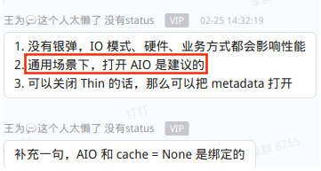

载丰想法 **⬇**

1.论点：打开 aio 是建议的。但是在全局设置中，云主机内核 aio 默认开启的做法，不可行。

打开 aio 需要满足2个条件 “not sparse image” & “cache mode=none”

2.参考之前的调研以及                     [TIC-60](http://jira.zstack.io/browse/TIC-60?src=confmacro)                            -            江门财政局 云主机数据盘四个月无法读写6次                                                Closed                 ，如果开启 aio 时云盘是一个sparse image，则可能会导致 I/O block。

如果生产环境break了，那就完蛋了。这是一个未知风险（虽然经过测试没有复现出来）。

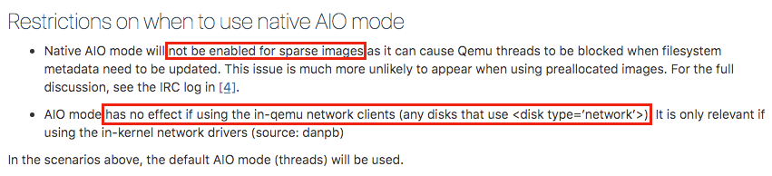

https://specs.openstack.org/openstack/nova-specs/specs/mitaka/implemented/libvirt-aio-mode.html

3.那什么样的 qcow2 算是一个 sparse image 呢？

| 预分配策略 | 是否算做 sparse image | 解释                                                         |
| :--------: | :-------------------: | :----------------------------------------------------------- |
|    none    |          是           | 非预分配方式。                                               |
|  metadata  |          是           | 分配qcow2的元数据 (metadata)，预分配后的虚拟磁盘仍然属于稀疏映像类型。分配元数据所需的空间，但不为数据分配任何空间。 |
|   falloc   |     介于两者之间      | 分配所有磁盘空间但不置零 (由于无需置0，创建磁盘速度会比full快很多，但性能和full不相上下)。 |
|    full    |          否           | 分配所有磁盘空间并置零 (非常耗时)，预分配后的虚拟磁盘属于非稀疏映像类型，为元数据和数据分配空间。 |

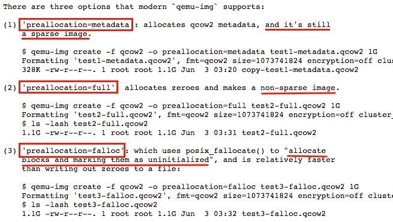

https://listman.redhat.com/archives/libvirt-users/2015-June/msg00009.html

4.那把全局变量中的磁盘预分配策略也默认改为 “falloc” 或者 “full” 不就好了？

这样也不行。full 的话要置0时间太久了，falloc的话也会引入其他的问题。

参考这个Jira                      [ZSTAC-22924](http://jira.zstack.io/browse/ZSTAC-22924?src=confmacro)                            -            云盘预置备在本地存储上默认使用falloc模式                                                Closed                 他们就是默认设为了 “falloc” 后来又改回了 “none”。

而且这个只针对本地存储的情况，**针对SharedBlock需要额外讨论**。

|  主存储类型  |  云盘预分配策略  |            解释            | 性能 | 是否算做 sparse image | 开启 aio 后是否可能 block I/O |
| :----------: | :--------------: | :------------------------: | :--: | :-------------------: | :---------------------------: |
| LocalStorage |   none（默认）   |        非预分配方式        | 一般 |          是           |              是               |
| LocalStorage |     metadata     |        预分配元数据        | 较好 |          是           |              是               |
| LocalStorage |      falloc      | 预分配所有磁盘空间但不置零 | 较好 |     介于两者之间      | 暂不确定（载丰暂时认为不会）  |
| LocalStorage |       full       |  预分配所有磁盘空间并置零  | 较好 |          否           |              否               |
| SharedBlock  |       none       |        非预分配方式        | 较好 |          是           | 暂不确定（载丰暂时认为不会）  |
| SharedBlock  | metadata（默认） |        预分配元数据        | 较好 |          是           | 暂不确定（载丰暂时认为不会）  |

5.以上表格，为什么对于 SharedBlock 来说 sparse image 不一定会造成 block I/O 呢？

首先为什么对于本地存储来说开了 aio 后如果是 sparse image 会导致 I/O 阻塞呢？

参考 OpenStack 文档描述，“filesystem metadata need to be updated”，随着云盘随机写入的增加，qcow2 在不断增大，文件系统在频繁的rebalance扩容并更新元数据。

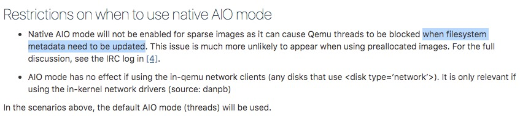

https://specs.openstack.org/openstack/nova-specs/specs/mitaka/implemented/libvirt-aio-mode.html

这会导致请求堆积并超过队列深度，造成 aio 下的阻塞。

“AIO blocks if anything in the I/O submission path is unable to complete inline.”

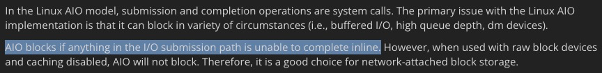

https://kb.blockbridge.com/technote/proxmox-aio-vs-iouring/

“Linux native aio mechanism blocks when the requests from user land exceeds  the hardware queue depth, it busy-waits the underlying hardware storage  device until previous requests completed so that leave room for new  requests.”

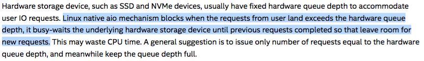

[kvm-tuning-guide-on-xeon-systems.pdf](file:///E:/github/Confluence-space-export-082101-45.html/lei.zhang/attachments/182137013/182137059.pdf)

对于 SharedBlock 来讲，这个 qcow2 在 lvm 上，没有文件系统，和本地存储不一样。（这也是 SharedBlock preallocation 无需 falloc 和 full 的原因）。

所以即使不置0，也没有文件系统频繁更新元数据一说。所以我觉得对于 SharedBlock 来讲应该不会 block I/O？

但以上只是我的理解，并不一定正确，大家说法不一，我对此结论依然持怀疑态度。

6.那怎么办？aio 就默认不开了？遇到风险就退缩了？有什么建议吗？

全局设置中的 aio 肯定不能默认开启，但是**可以针对不同场景分别去做处理**。

参考 OpenStack 文档：

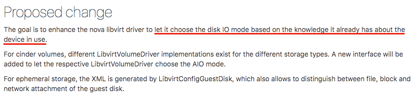

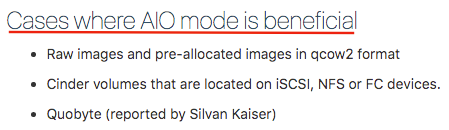

https://specs.openstack.org/openstack/nova-specs/specs/mitaka/implemented/libvirt-aio-mode.html

其实以上这些文档也有互相矛盾的地方，比方说

a.前面它说 “AIO mode has no effect if using the in-qemu network clients” 但是后面它又提到 “Cases where AIO mode is beneficial：volumes that are located on iSCSI, NFS or FC devices”

b.前面它说 “Native AIO mode will not be enabled for sparse images” 但是后面它又提到 “Cases where AIO mode is beneficial：pre-allocated images in qcow2 format”。实际上 preallocation=metadata 属于 pre-allocated image 但也属于 sparse image。那到底是需不需要打开呢？没说清楚。

这个 feature 值得去做，但是我们需要调查清楚这些东西。

建议找个OpenStack环境或H3C Cloud直接上去看看它们的逻辑是怎么样子的，可能更有效。

7.那目前暂时的结论是啥？

先不做这个。

至少需要等待我们的内核升级到更高版本再去支持默认开启异步I/O。

内核从 5.1.21 版本开始支持 io_uring API，它是一个新的异步 API，解决了 aio 本身的问题。

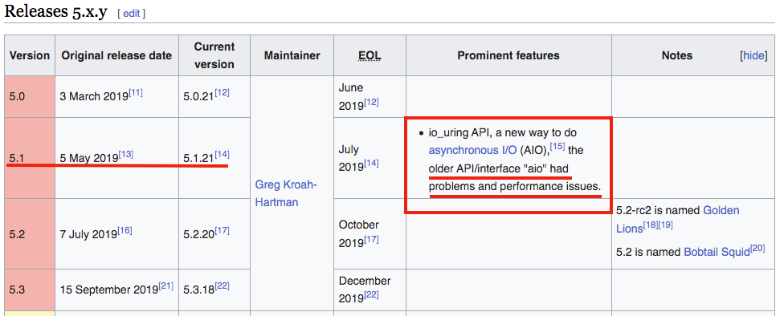

https://en.wikipedia.org/wiki/Linux_kernel_version_history

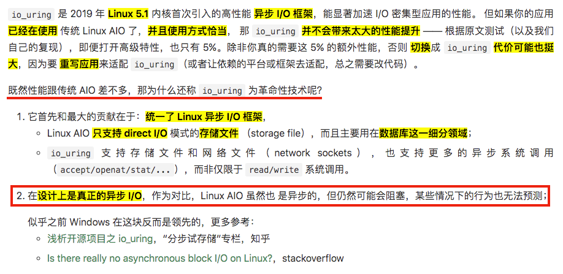

https://arthurchiao.art/blog/intro-to-io-uring-zh/

我们现在默认的内核是3.10，实验性的内核是4.18，距离更高版本的内核还有一些路要走。

| 内核版本 | 是否支持aio | 是否支持io_uring |
| :------: | :---------: | :--------------: |
|   3.10   |     是      |        否        |
|   4.18   |     是      |        否        |
|  5.1.21  |     是      |        是        |

| 异步I/O类型 |  VM XML 区别   |  **虚拟化模块版本要求**  | 内核版本要求 | 是否可能会中断业务 造成block |
| :---------: | :------------: | :----------------------: | :----------: | :--------------------------: |
|     无      | io=threads'/>  |            无            |      无      |              否              |
| native aio  |  io=native'/>  |      libvirt>=0.8.8      |    >=2.6     |              是              |
|  io_uring   | io=io_uring'/> | libvirt>=6.3.0 Qemu>=5.0 |   >=5.1.21   |              否              |

------

# 关于默认开启内核 aio 讨论

**(一)** 别的厂商现阶段，有没有默认开启内核 aio **⬇**

**https://access.redhat.com/documentation/en-us/red_hat_enterprise_linux/7/html/virtualization_tuning_and_optimization_guide/sect-virtualization_tuning_optimization_guide-blockio-io_mode**

1. **Red Hat Enterprise Linux 7** 默认不开启内核 aio，默认 I/O 模式是 threads：“spawns a pool of Qemu threads to handle requests”。

**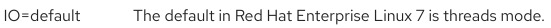**

**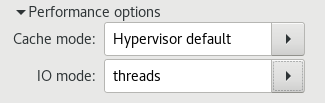**

2. **Red Hat Virtualization (RHV)** 默认开启内核 aio，默认 I/O 模式是 native：”linux native libaio asynchronous block IO mechanism“。

3. **OpenStack** 默认不开启内核 aio，默认 I/O 模式是 threads：“spawns a pool of Qemu threads to handle requests”。

[qemu-disk-io-which-performs-better-native-or-threads.pdf](file:///E:/github/Confluence-space-export-082101-45.html/lei.zhang/attachments/182137013/182137066.pdf)

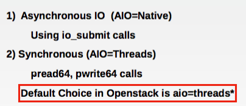

**(二)** 如果默认开启内核 aio 可能会带来哪些负面影响 **⬇**

[kvm-tuning-guide-on-xeon-systems.pdf](file:///E:/github/Confluence-space-export-082101-45.html/lei.zhang/attachments/182137013/182137059.pdf)

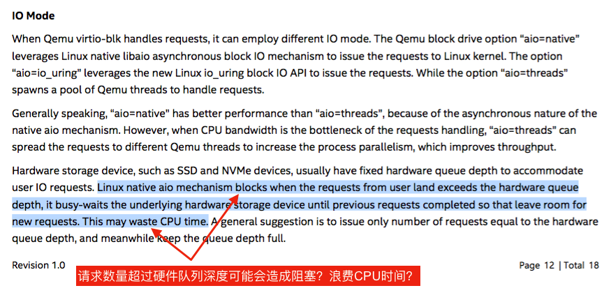

https://kb.blockbridge.com/technote/proxmox-aio-vs-iouring/

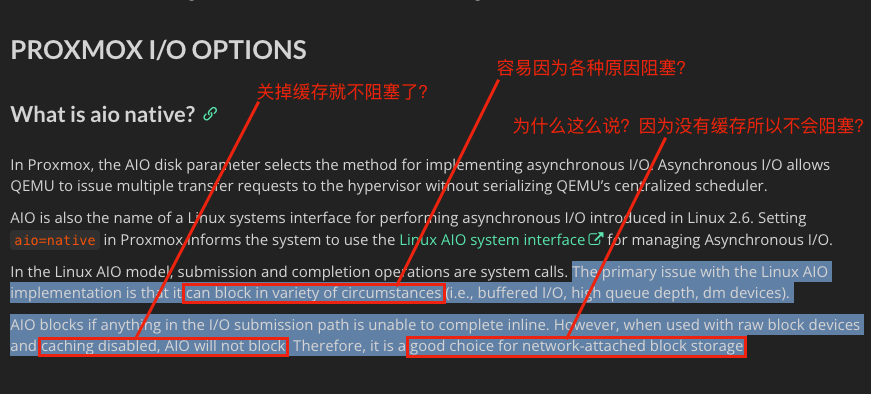

[qemu-disk-io-which-performs-better-native-or-threads.pdf](file:///E:/github/Confluence-space-export-082101-45.html/lei.zhang/attachments/182137013/182137066.pdf)

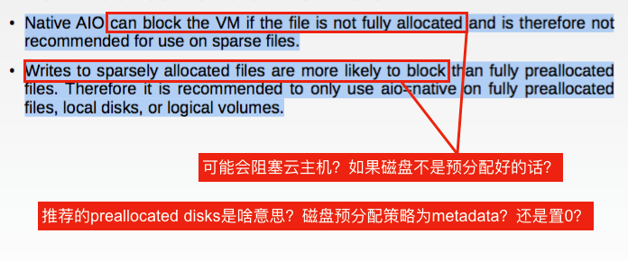

**(三)** 载丰想法 **⬇**

1.论点：打开 aio 是建议的。但是在全局设置中，云主机内核 aio 默认开启的做法，不可行。

打开 aio 需要满足2个条件 “not sparse image” & “cache mode=none”

2.参考之前的调研以及                     [TIC-60](http://jira.zstack.io/browse/TIC-60?src=confmacro)                            -            江门财政局 云主机数据盘四个月无法读写6次                                                Closed                 ，如果开启 aio 时云盘是一个sparse image，则可能会导致 I/O block。

如果生产环境break了，那就完蛋了。这是一个未知风险（虽然经过测试没有复现出来）。

https://specs.openstack.org/openstack/nova-specs/specs/mitaka/implemented/libvirt-aio-mode.html

3.那什么样的 qcow2 算是一个 sparse image 呢？

| 预分配策略 | 是否算做 sparse image | 解释                                                         |
| :--------: | :-------------------: | :----------------------------------------------------------- |
|    none    |          是           | 非预分配方式。                                               |
|  metadata  |          是           | 分配qcow2的元数据 (metadata)，预分配后的虚拟磁盘仍然属于稀疏映像类型。分配元数据所需的空间，但不为数据分配任何空间。 |
|   falloc   |     介于两者之间      | 分配所有磁盘空间但不置零 (由于无需置0，创建磁盘速度会比full快很多，但性能和full不相上下)。 |
|    full    |          否           | 分配所有磁盘空间并置零 (非常耗时)，预分配后的虚拟磁盘属于非稀疏映像类型，为元数据和数据分配空间。 |

https://listman.redhat.com/archives/libvirt-users/2015-June/msg00009.html

4.那把全局变量中的磁盘预分配策略也默认改为 “falloc” 或者 “full” 不就好了？

这样也不行。full 的话要置0时间太久了，falloc的话也会引入其他的问题。

参考这个Jira                      [ZSTAC-22924](http://jira.zstack.io/browse/ZSTAC-22924?src=confmacro)                            -            云盘预置备在本地存储上默认使用falloc模式                                                Closed                 他们就是默认设为了 “falloc” 后来又改回了 “none”。

而且这个只针对本地存储的情况，**针对SharedBlock需要额外讨论**。

|  主存储类型  |  云盘预分配策略  |            解释            | 性能 | 是否算做 sparse image | 开启 aio 后是否可能 block I/O |
| :----------: | :--------------: | :------------------------: | :--: | :-------------------: | :---------------------------: |
| LocalStorage |   none（默认）   |        非预分配方式        | 一般 |          是           |              是               |
| LocalStorage |     metadata     |        预分配元数据        | 较好 |          是           |              是               |
| LocalStorage |      falloc      | 预分配所有磁盘空间但不置零 | 较好 |     介于两者之间      | 暂不确定（载丰暂时认为不会）  |
| LocalStorage |       full       |  预分配所有磁盘空间并置零  | 较好 |          否           |              否               |
| SharedBlock  |       none       |        非预分配方式        | 较好 |          是           | 暂不确定（载丰暂时认为不会）  |
| SharedBlock  | metadata（默认） |        预分配元数据        | 较好 |          是           | 暂不确定（载丰暂时认为不会）  |

5.以上表格，为什么对于 SharedBlock 来说 sparse image 不一定会造成 block I/O 呢？

首先为什么对于本地存储来说开了 aio 后如果是 sparse image 会导致 I/O 阻塞呢？

参考 OpenStack 文档描述，“filesystem metadata need to be updated”，随着云盘随机写入的增加，qcow2 在不断增大，文件系统在频繁的rebalance扩容并更新元数据。

https://specs.openstack.org/openstack/nova-specs/specs/mitaka/implemented/libvirt-aio-mode.html

这会导致请求堆积并超过队列深度，造成 aio 下的阻塞。

“AIO blocks if anything in the I/O submission path is unable to complete inline.”

https://kb.blockbridge.com/technote/proxmox-aio-vs-iouring/

“Linux native aio mechanism blocks when the requests from user land exceeds  the hardware queue depth, it busy-waits the underlying hardware storage  device until previous requests completed so that leave room for new  requests.”

[kvm-tuning-guide-on-xeon-systems.pdf](file:///E:/github/Confluence-space-export-082101-45.html/lei.zhang/attachments/182137013/182137059.pdf)

对于 SharedBlock 来讲，这个 qcow2 在 lvm 上，没有文件系统，和本地存储不一样。（这也是 SharedBlock preallocation 无需 falloc 和 full 的原因）。

所以即使不置0，也没有文件系统频繁更新元数据一说。所以我觉得对于 SharedBlock 来讲应该不会 block I/O？

但以上只是我的理解，并不一定正确，大家说法不一，我对此结论依然持怀疑态度。

6.那怎么办？aio 就默认不开了？遇到风险就退缩了？有什么建议吗？

全局设置中的 aio 肯定不能默认开启，但是**可以针对不同场景分别去做处理**。

参考 OpenStack 文档：

https://specs.openstack.org/openstack/nova-specs/specs/mitaka/implemented/libvirt-aio-mode.html

其实以上这些文档也有互相矛盾的地方，比方说

a.前面它说 “AIO mode has no effect if using the in-qemu network clients” 但是后面它又提到 “Cases where AIO mode is beneficial：volumes that are located on iSCSI, NFS or FC devices”

b.前面它说 “Native AIO mode will not be enabled for sparse images” 但是后面它又提到 “Cases where AIO mode is beneficial：pre-allocated images in qcow2 format”。实际上 preallocation=metadata 属于 pre-allocated image 但也属于 sparse image。那到底是需不需要打开呢？没说清楚。

这个 feature 值得去做，但是我们需要调查清楚这些东西。

建议找个OpenStack环境或H3C Cloud直接上去看看它们的逻辑是怎么样子的，可能更有效。

7.那目前暂时的结论是啥？

先不做这个。

至少需要等待我们的内核升级到更高版本再去支持默认开启异步I/O。

内核从 5.1.21 版本开始支持 io_uring API，它是一个新的异步 API，解决了 aio 本身的问题。

https://en.wikipedia.org/wiki/Linux_kernel_version_history

https://arthurchiao.art/blog/intro-to-io-uring-zh/

我们现在默认的内核是3.10，实验性的内核是4.18，距离更高版本的内核还有一些路要走。

| 内核版本 | 是否支持aio | 是否支持io_uring |
| :------: | :---------: | :--------------: |
|   3.10   |     是      |        否        |
|   4.18   |     是      |        否        |
|  5.1.21  |     是      |        是        |

| 异步I/O类型 |  VM XML 区别  | **虚拟化模块版本要求** | 内核版本要求 | 是否可能会中断业务 造成block |
| :---------: | :-----------: | :--------------------: | :----------: | :--------------------------: |
|     无      | io=threads'/> |           无           |      无      |              否              |
| native aio  | io=native'/>  |     libvirt>=0.8.8     |    >=2.6     |              是              |