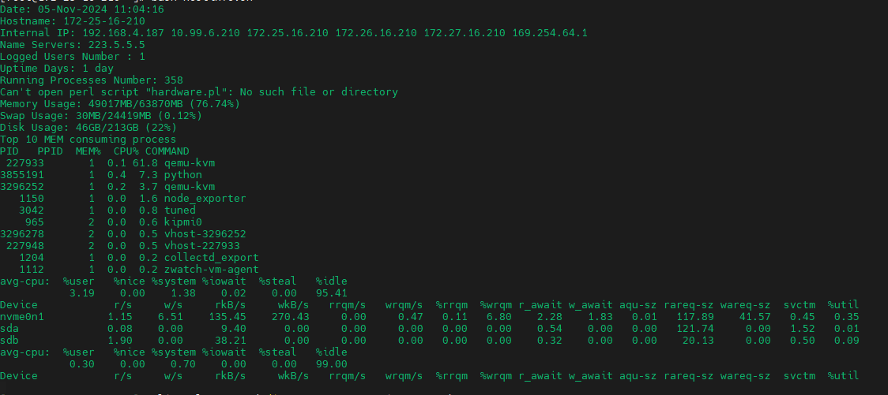

#### 脚本类型1  基础系统硬件容量   

​       

```
LoginUserNum=`who | wc -l`
OpenProcesNum=$(expr $(ps aux | wc -l) - 1)
echo -e '\E[32m'"Date:" `date +"%d-%h-%Y %T"`
#echo -e '\E[32m'"System:" `cat /etc/redhat-release`
#echo -e '\E[32m'"Kernel:" `uname -r`
echo -e '\E[32m'"Hostname:" $tecreset $HOSTNAME
internalip=$(hostname -I)
echo -e '\E[32m'"Internal IP:" $tecreset $internalip
nameservers=$(cat /etc/resolv.conf | sed '1 d' | awk '{print $2}')
echo -e '\E[32m'"Name Servers:" $tecreset $nameservers
echo "Logged Users Number :" $LoginUserNum
tecuptime=$(uptime | awk '{print $3,$4}' | cut -f1 -d,)
echo -e '\E[32m'"Uptime Days:" $tecreset $tecuptime
echo "Running Processes Number:" $OpenProcesNum
#echo -e '\E[32m'"CPU Core Number:" `cat /proc/cpuinfo |grep -c processor`
perl hardware.pl
free -m | awk 'NR==2{printf "Memory Usage: %sMB/%sMB (%.2f%%)\n", $3,$2,$3*100/$2 }'
free -m | awk 'NR==3{printf "Swap Usage: %sMB/%sMB (%.2f%%)\n", $3,$2,$3*100/$2 }'
df -h | awk '$NF=="/"{printf "Disk Usage: %dGB/%dGB (%s)\n", $3,$2,$5}'
echo -e '\E[32m'"Top 10 MEM consuming process"
k1sort="sort -nr -k 4"
echo -e '\E[32m'"PID   PPID  MEM%  CPU% COMMAND "
ps -Ao pid= -o ppid= -o pmem= -o pcpu= -o comm=|$k1sort|head -10
#du -h / --max-depth=1 |grep G|sort -n
iostat -xz 1 2| grep Linux -v| sed '/^$/d'
echo -e "\033[40;37m \033[0m"
```

效果展示




#### 主机系统详情信息

​       

```
#!/bin/bash
#用于获取软件版本  硬件信息   ForCentOS　
yum   install  lshw


# 获取并打印CPU型号和数量
lshw   | grep "product"
echo "1. CPU型号和数量:" | tee hardware_info.txt
> software_info.txt
truncate -s 0 software_info.txt
echo "1. CPU型号和数量:" | tee hardware_info.txt
cpu_model=$(lshw -class processor | grep "product" | uniq | awk -F': ' '{print $2}')
cpu_count=$(lshw -class processor | grep -c "product")
echo "CPU型号: $cpu_model" | tee -a hardware_info.txt
echo "CPU数量: $cpu_count" | tee -a hardware_info.txt

# 获取并打印内存条型号和数量   还需要排除description   product      中两个都满足这样的情况的product   为 NO DIMM  
#  description是empty的
echo "" | tee -a hardware_info.txt

echo "lscpu"


lscpu 

lscpu  | tee   -a   hardware_info.txt


echo "lscpu"

echo "___________________________________________________________________________________________________________________________"

echo "2. 内存条型号和数量:" | tee -a hardware_info.txt
# lshw -class memory | tee -a hardware_info.txt  # 打印原始内存信息
# lshw -class memory |  grep -v -E "description: DIMM \[empty\]|product: NO DIMM" 
# lshw -class memory | grep -v "description: DIMM \[empty\]" | grep -v "product: NO DIMM"  | grep -v "vendor: NO DIMM"   | grep -v "serial: NO DIMM"  | grep "size:"
# lshw -class memory | grep -v "description: DIMM \[empty\]" | grep -v "product: NO DIMM"  | grep -v "vendor: NO DIMM"   | grep -v "serial: NO DIMM" 
# lshw -class memory | grep -v "description: DIMM \[empty\]" | grep -v "product: NO DIMM" | grep -v "vendor: NO DIMM" | grep -v "serial: NO DIMM" | awk '' | awk 'BEGIN{FS=":"}{if ($2 ~ /size/) print}'
# # 0246   lshw -class memory | grep -v "description: DIMM \[empty\]" | grep -v "product: NO DIMM" | grep -v "vendor: NO DIMM" | grep -v "serial: NO DIMM" | grep "size:"lshw -class memory | grep -A 10 "-bank:" | grep -v "description: DIMM \[empty\]" | grep -v "product: NO DIMM" | grep -v "vendor: NO DIMM" | grep -v "serial: NO DIMM" | grep -B 1 "size:"
memory_info=$(lshw -class memory | grep -v "description: DIMM \[empty\]" | grep -v "product: NO DIMM"  | grep -v "vendor: NO DIMM"   | grep -v "serial: NO DIMM"  | grep -E "description|size|product"  | awk '/description: DIMM/ {do {print; getline} while ($0 ~ /product:/ || $0 ~ /size:/ || $0 ~ /description: DIMM/)}')
memory_count=$(echo "$memory_info" | grep -c "product")
lshw -class memory | grep -v "description: DIMM \[empty\]" | grep -v "product: NO DIMM"  | grep -v "vendor: NO DIMM"   | grep -v "serial: NO DIMM"  | grep -E "description|size|product"  | awk '/description: DIMM/ {do {print; getline} while ($0 ~ /product:/ || $0 ~ /size:/ || $0 ~ /description: DIMM/)}'

echo "$memory_info" | tee -a hardware_info.txt
echo "内存条数量: $memory_count" | tee -a hardware_info.txt

echo "内存"
free -h
free -h | tee   -a   hardware_info.txt
dmidecode -t memory
echo "内存"

lshw -class disk | grep -E "description|logical name|size|product" | awk '
BEGIN { RS=""; ORS="\n" }
{
    if ($2 ~ /description:/) {
        # 遇到新的 description:，清空 buffer 并开始收集信息
        clear();
        add_to_buffer($0);
    }
    else if ($2 ~ /size:/) {
        # 遇到 size:，打印 buffer 中的内容并清空 buffer
        print_buffer();
        clear();
    }
    else {
        # 遇到其他行，将其添加到 buffer
        add_to_buffer($0);
    }
}
function clear() {
    # 清空 buffer
    delete buffer;
    buffer_idx = 0;
}
function add_to_buffer(line) {
    # 将行添加到 buffer
    buffer[++buffer_idx] = line;
}
function print_buffer() {
    # 打印 buffer 中的所有行
    for (i = 1; i <= buffer_idx; i++) {
        print buffer[i];
    }
}
'

# 获取并打印系统盘信息和挂载的SSD/HDD信息
echo "" | tee -a hardware_info.txt
echo "3. 系统盘和挂载的SSD/HDD盘:" | tee -a hardware_info.txt
lshw -class disk | grep -E "description|logical name|size|product"
disk_info=$(lshw -class disk | grep -E "description|logical name|size|product")
echo "$disk_info" | tee -a hardware_info.txt

# 获取并打印网卡信息
echo "" | tee -a hardware_info.txt
echo "4. 网卡信息:" | tee -a hardware_info.txt
gigabit_nics=$(lshw -class network | grep -A 12 "Ethernet" | grep -B 11 "size: 1Gbit/s")
ten_gigabit_nics=$(lshw -class network | grep -A 12 "Ethernet" | grep -B 11 "size: 10Gbit/s")
echo "Gigabit网卡:" | tee -a hardware_info.txt
echo "$gigabit_nics" | tee -a hardware_info.txt
echo "" | tee -a hardware_info.txt
echo "10-Gigabit网卡:" | tee -a hardware_info.txt
echo "$ten_gigabit_nics" | tee -a hardware_info.txt

# 获取并打印RAID卡信息
lshw -class storage
echo "" | tee -a hardware_info.txt
echo "5. RAID卡信息:" | tee -a hardware_info.txt
raid_info=$(lshw -class storage )
echo "$raid_info" | tee -a hardware_info.txt

# 获取并打印服务器型号
echo "" | tee -a hardware_info.txt
echo "6. 服务器型号:" | tee -a hardware_info.txt
server_model=$( lshw -class  system | grep  " product" )
echo "服务器型号: $server_model" | tee -a hardware_info.txt
 lshw -class  system | grep  " product"
echo "信息已保存到 hardware_info.txt 文件中."

cat   /etc/centos-release
cat   /etc/redhat-release
 libvirtd -V
 qemu-img  -V
#清空该文件里面记录  software_info.txt


echo "" | tee -a software_info.txt
> software_info.txt
truncate -s 0 software_info.txt
echo "1. linux系统:" | tee -a software_info.txt

echo "1. libivirted版本:" | tee -a software_info.txt
libivirted_version=$( libvirtd -V)
echo "libivirted版本: $libivirted_version" | tee -a software_info.txt
echo "qemu版本:" | tee -a software_info.txt
qemu_version=$( qemu-img  -V)
echo "qemu版本: $qemu_version" | tee -a software_info.txt

 #lshw -class  system | grep  " product"
echo "信息已保存到 software_info.txt 文件中."


LOGFILE="/root/machine.log"
(

sudo yum install -y fio
sudo yum clean  all
sudo yum makecache
sudo yum install unzip -y


cd /root


# git  clone https://github.com/cmatsuoka/figlet.git
# cd figlet/
cd  figlet/
ls
sudo make
sudo make install

figlet  "Good Luck!"

figlet  "HAPPY    HAPPY       HAPPY!"
figlet   "??????♥ 或 <3"

figlet -f slant ""

figlet  "eth"
lspci | grep Eth
figlet  "CPU"
lscpu
figlet  "FREE"
free -g
free -h
figlet  "DISK"
figlet  "Disk layout"
lsblk
figlet "Disk space usage:"
df -h  
figlet sda
smarctl -i  /dev/sda 
figlet   "SMART information for all disks:"
echo "SMART information for all disks:"
for disk in /dev/sd* /dev/nvme*; do
    if [ -e "$disk" ]; then
        echo "Checking $disk..."
        smartctl -i "$disk"
    else
        echo "No such disk: $disk"
    fi
done
) |& tee -a  "$LOGFILE"
```

运行结果  产生对应的log和txt文件记录软硬件相关信息


