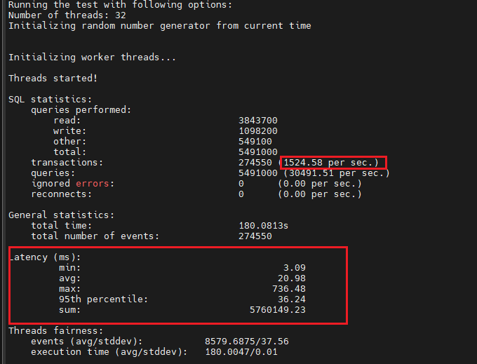
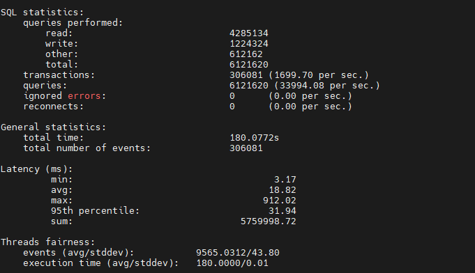
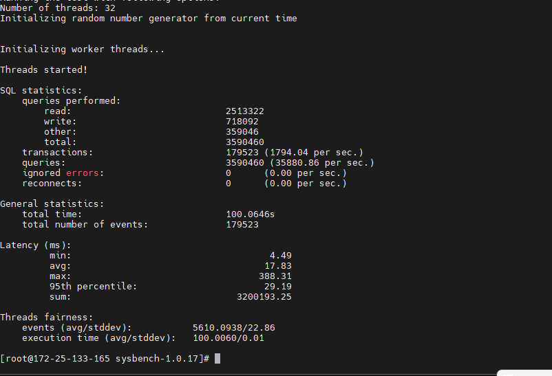
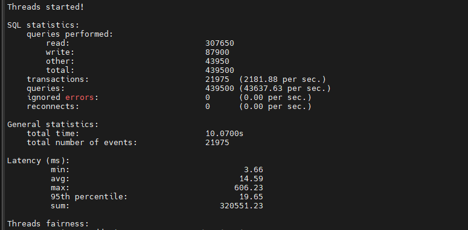
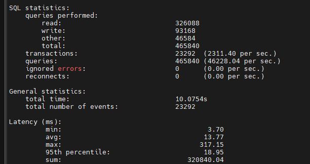
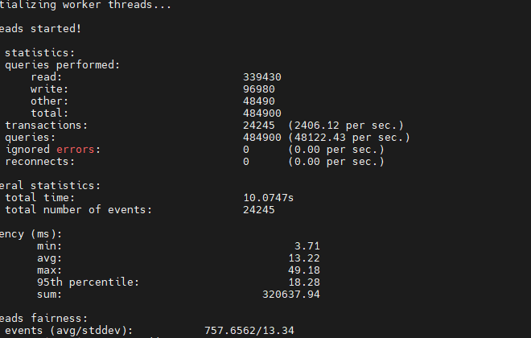

介绍   


需求  


部署 

前提：  完成了文档里面的数据库先验配置（安装对应数据库做相应配置啥的 ）

步骤  

1. 依赖引入和数据库基本配置
2. 源代码编译安装sysbench


```
#!/bin/bash
echo "执行数据库和软件包依赖安装操作。"

echo "尝试以root用户登录MySQL，并创建名为'sbtest'的数据库，然后列出所有数据库。"
mysql -uroot -p'Furina@1013' -e "create database sbtest;" -e "show databases;"
echo "再次列出所有数据库，以确认'sbtest'数据库是否已创建。"
mysql -uroot -p'Furina@1013' -e "show databases;"

echo "安装编译工具，包括gcc, gcc-c++, autoconf, automake, make, libtool。"
yum install gcc gcc-c++ autoconf automake make libtool  -y

echo "安装MySQL开发库，注意GPG检查已被禁用。"
yum install mysql-devel --nogpgcheck  -y

echo "所有操作完成"
#!/bin/bash

# 安装 mlocate 并更新其数据库
echo "安装 mlocate 并更新其数据库..."
if ! yum list installed | grep -q mlocate; then
    yum install -y mlocate
fi
updatedb

# 使用 locate 命令查找 my.cnf 配置文件
echo "使用 locate 命令查找 my.cnf 配置文件..."
my_cnf_files=$(locate my.cnf)

# 检查找到的 my.cnf 文件数量
if [ -z "$my_cnf_files" ]; then
    echo "未找到 my.cnf 配置文件，请手动定位并修改 max_prepared_stmt_count 参数。"
    exit 1
fi

# 提示用户选择 my.cnf 文件进行编辑
echo "找到以下 my.cnf 配置文件，请选择一个进行编辑："
echo "$my_cnf_files"
read -p "请输入文件路径：" chosen_file
cat /etc/my.cnf
echo "max_prepared_stmt_count = 50000000" >>/etc/my.cnf
# 编辑 my.cnf 文件以增加 max_prepared_stmt_count 的值
echo "编辑 my.cnf 文件以增加 max_prepared_stmt_count 的值..."
echo "编辑 my.cnf 文件以增加 max_prepared_stmt_count 的值..."
#echo "max_prepared_stmt_count = 50000000" >> "$my_cnf_path"
echo "重启mysql应用更改"
systemctl restart mysqld
#!/bin/bash
mkdir -p /dbtest
cd /dbtest
wget http://smb.zstack.io/mirror/lei.zhang/sysbench-1.0.17.zip
unzip sysbench-1.0.17.zip
cd sysbench-1.0.17
sudo yum install autoconf automake libtool
./autogen.sh
./configure --prefix=/usr
 make
make install
sysbench  ./src/lua/oltp_read_write.lua --table_size=100 --tables=64 --threads=32 --db-driver=mysql --mysql-host=127.0.0.1 --mysql-user=root --mysql-password=Furina@1013 prepare
sysbench  ./src/lua/oltp_read_write.lua --table_size=100 --tables=64 --threads=32  --table_size=100  --db-driver=mysql --db-driver=mysql --mysql-host=127.0.0.1 --mysql-user=root --mysql-password=Furina@1013 cleanup
```


准备

前提： 完成了文档里面的数据库先验测试  结果没有很逆天

构建一个很短时间的sysbenchcase跑一下 验证一下工具可用性  顺带看一下有没有出现明显不符合常理的结果

```
 cd /dbtest/sysbench-1.0.17
sysbench  ./src/lua/oltp_read_write.lua --table_size=10000 --tables=64 --threads=32 --db-driver=mysql  --mysql-host=127.0.0.1 --mysql-user=root --mysql-password=Furina@1013 prepare
sysbench  ./src/lua/oltp_read_write.lua --table_size=10000 --tables=64 --threads=32  --db-driver=mysql --mysql-host=127.0.0.1 --mysql-user=root --mysql-password=Furina@1013    --time=180  run
sysbench  ./src/lua/oltp_read_write.lua --table_size=10000 --tables=64 --threads=32  --db-driver=mysql --mysql-host=127.0.0.1 --mysql-user=root --mysql-password=Furina@1013 cleanup
```


运行  

前提 ： 上面的流程问题不大

构建一个充足warm up 的 其余配置尽量好的case跑一下 获得真实的OLTP测试结果

```
echo "完整的一轮sysbench测试  单表10万级别   64表单     32线程   测试时长180s "
 cd /dbtest/sysbench-1.0.17
sysbench  ./src/lua/oltp_read_write.lua --table_size=100000 --tables=64 --threads=32 --db-driver=mysql  --mysql-host=127.0.0.1 --mysql-user=root --mysql-password=Furina@1013 prepare
sysbench  ./src/lua/oltp_read_write.lua --table_size=100000 --tables=64 --threads=32  --db-driver=mysql --mysql-host=127.0.0.1 --mysql-user=root --mysql-password=Furina@1013    --time=180  run
sysbench  ./src/lua/oltp_read_write.lua --table_size=100000 --tables=64 --threads=32  --db-driver=mysql --mysql-host=127.0.0.1 --mysql-user=root --mysql-password=Furina@1013 cleanup
```


数据收集  

截图保存 

使用excel  origin  之类的软件做数据记录



vSphere的QPS ：1524.58     延迟  20.98

vSphere的QPS ：1699.70     延迟  18.82


ZSphere的QPS： 1469.84      延迟  21.66

ZSphere的QPS： 1794.04      延迟 17.83





万条记录DB  vs   2200到2400之间 



  


处理

分析数据  做可视化  编写文档 

监控   