- [修改记录](file:///E:/github/Confluence-space-export-082101-45.html/lei.zhang/177266962.html#aaaa网络性能调优-修改记录)
- [简介](file:///E:/github/Confluence-space-export-082101-45.html/lei.zhang/177266962.html#aaaa网络性能调优-简介)
- [方法论](file:///E:/github/Confluence-space-export-082101-45.html/lei.zhang/177266962.html#aaaa网络性能调优-方法论)
- 物理机配置
  - 关闭超线程（可选）
    - [原理](file:///E:/github/Confluence-space-export-082101-45.html/lei.zhang/177266962.html#aaaa网络性能调优-原理)
    - [操作](file:///E:/github/Confluence-space-export-082101-45.html/lei.zhang/177266962.html#aaaa网络性能调优-操作)
    - 
  - 打开多 NUMA（AMD上推荐）
    - [原理](file:///E:/github/Confluence-space-export-082101-45.html/lei.zhang/177266962.html#aaaa网络性能调优-原理.1)
    - [操作](file:///E:/github/Confluence-space-export-082101-45.html/lei.zhang/177266962.html#aaaa网络性能调优-操作.1)
  - 其他 BIOS 调整（Intel）
    - [操作](file:///E:/github/Confluence-space-export-082101-45.html/lei.zhang/177266962.html#aaaa网络性能调优-操作.2)
  - 其他 BIOS 调整（AMD）
    - [操作](file:///E:/github/Confluence-space-export-082101-45.html/lei.zhang/177266962.html#aaaa网络性能调优-操作.3)
  - 升级内核（推荐）
    - [原理](file:///E:/github/Confluence-space-export-082101-45.html/lei.zhang/177266962.html#aaaa网络性能调优-原理.2)
    - [操作](file:///E:/github/Confluence-space-export-082101-45.html/lei.zhang/177266962.html#aaaa网络性能调优-操作.4)
  - 调整物理网卡参数（部分推荐）
    - [原理](file:///E:/github/Confluence-space-export-082101-45.html/lei.zhang/177266962.html#aaaa网络性能调优-原理.3)
    - [操作](file:///E:/github/Confluence-space-export-082101-45.html/lei.zhang/177266962.html#aaaa网络性能调优-操作.5)
  - 跳过 zsn 网络规则（推荐）
    - [原理](file:///E:/github/Confluence-space-export-082101-45.html/lei.zhang/177266962.html#aaaa网络性能调优-原理.4)
    - [操作](file:///E:/github/Confluence-space-export-082101-45.html/lei.zhang/177266962.html#aaaa网络性能调优-操作.6)
  - 关闭 iptables、ebtables（可选）
    - [原理](file:///E:/github/Confluence-space-export-082101-45.html/lei.zhang/177266962.html#aaaa网络性能调优-原理.5)
    - [操作](file:///E:/github/Confluence-space-export-082101-45.html/lei.zhang/177266962.html#aaaa网络性能调优-操作.7)
  - 调整 NAPI 参数（可选）
    - [原理](file:///E:/github/Confluence-space-export-082101-45.html/lei.zhang/177266962.html#aaaa网络性能调优-原理.6)
    - [操作](file:///E:/github/Confluence-space-export-082101-45.html/lei.zhang/177266962.html#aaaa网络性能调优-操作.8)
  - 调整 kvm_amd 参数（AMD推荐）
    - [原理](file:///E:/github/Confluence-space-export-082101-45.html/lei.zhang/177266962.html#aaaa网络性能调优-原理.7)
    - [操作](file:///E:/github/Confluence-space-export-082101-45.html/lei.zhang/177266962.html#aaaa网络性能调优-操作.9)
- 平台侧配置
  - 设置 vCPU 绑定（推荐）
    - [原理](file:///E:/github/Confluence-space-export-082101-45.html/lei.zhang/177266962.html#aaaa网络性能调优-原理.8)
  - 适当的 CPU、内存（推荐）
    - [原理](file:///E:/github/Confluence-space-export-082101-45.html/lei.zhang/177266962.html#aaaa网络性能调优-原理.9)
    - [操作](file:///E:/github/Confluence-space-export-082101-45.html/lei.zhang/177266962.html#aaaa网络性能调优-操作.10)
  - 设置虚拟网卡多队列（推荐）
    - [原理](file:///E:/github/Confluence-space-export-082101-45.html/lei.zhang/177266962.html#aaaa网络性能调优-原理.10)
    - [操作](file:///E:/github/Confluence-space-export-082101-45.html/lei.zhang/177266962.html#aaaa网络性能调优-操作.11)
    - 云主机内部设置xps（推荐）
      - [原理](file:///E:/github/Confluence-space-export-082101-45.html/lei.zhang/177266962.html#aaaa网络性能调优-原理.11)
      - [操作](file:///E:/github/Confluence-space-export-082101-45.html/lei.zhang/177266962.html#aaaa网络性能调优-操作.12)
  - 开启 tx zero copy（可选）
    - [操作](file:///E:/github/Confluence-space-export-082101-45.html/lei.zhang/177266962.html#aaaa网络性能调优-操作.13)
  - 打开大页内存（可选）
    - [操作](file:///E:/github/Confluence-space-export-082101-45.html/lei.zhang/177266962.html#aaaa网络性能调优-操作.14)
  - 检查 EPT、hyper-v、CPU Model 等参数（推荐）
    - [操作](file:///E:/github/Confluence-space-export-082101-45.html/lei.zhang/177266962.html#aaaa网络性能调优-操作.15)
- [虚拟机 XML](file:///E:/github/Confluence-space-export-082101-45.html/lei.zhang/177266962.html#aaaa网络性能调优-虚拟机XML)
- [效果展示](file:///E:/github/Confluence-space-export-082101-45.html/lei.zhang/177266962.html#aaaa网络性能调优-效果展示)


## 修改记录

| 修改时间   | 修改人 | 修改状态 | 备注    |
| ---------- | ------ | -------- | ------- |
| 2020.6.30  | 王为   | Draft    | 创建    |
| 2022.10.31 | 杨登松 | Draft    | 增加xps |

## 简介

本文介绍了在 CentOS 物理机，Linux Bridge + Virtio 网络模型的一些性能相关的检查和优化。

## 方法论

本文档的推荐配置可以直接采用，可选配置可以根据实际情况或者根据手动测试开关，标题前标注  说明实际测试该项对性能有较大影响，可以优先测试。


对于 **10W pps** 以下的场景，平台应该**不需要任何调优**可以直接支撑；

对于 **10W ~ 50W pps** 的场景，可能需要**根据观察做一些简单优化**，例如网卡多队列、合理分配 CPU 资源等平台侧支持的优化；

对于 **50W ~ 200W pps 的场景，需要做比较激进的优化**，例如升级内核、可能需要关闭 iptables、ebtables 等，**这个性能基本可以达到虚拟机内核收发包的性能极限**，因此虚拟机内不使用 DPDK 等方法收发包的话，这个数据已经可以满足各种场景需求。

对于 **300W pps** 以上的场景，建议使用 **SRIOV**，纯软方案有本身资源占用多、性能易受各方面因素影响等问题，建议考虑偏向硬件例如 SRIOV、vDPA 的方案。


对于使用 SRIOV 的场景，本文档的 Bridge、virtio 相关的调优都可以跳过，其他配置根据实际情况测试为准。

从测试方法上讲，网络性能属于 IO 相关的测试，普遍建议多测试几次，观察是否有变化，因为 IO 往往和 Cache 有关，而现代计算机体系架构中包含这非常多层的 cache，多执行几次后可能才能获得稳定、较好的数据。

从调优上讲，应当尽量分层、量化的调查性能瓶颈，再做相应调优，观察 virtio、网卡、虚拟机 CPU 等性能数据，找打正确的瓶颈予以优化或者资源上予以倾斜，例如 vCPU 没有跑满，vhost  压力很大，那可以适当减小 vCPU 数量，增加网卡队列数量和 emulator 的 pin 数量，可能起到事半功倍的效果。

从工具上讲，iperf 主要测试大包吞吐，性能波动小，如果要测试比较严苛的场景，推荐使用 Spirent、IXIA、fortitester 等硬件测试仪或 trex  等软件测试仪进行测试。此外建议用 CentOS 7.4 来作为 DUT（即接流的机器，或者说被测试的机器）。**实测 CentOS 7.6 的默认性能弱于 CentOS 7.4**，可能与 CentOS 7.6 使用了比较低效的 Spectre 补丁有关.

## 物理机配置

### 关闭超线程（可选）

#### 原理

如果是针对测试场景，可以关闭物理机超线程以简化配置，避免在同一个CPU的两个超线程争抢资源，特别是 IO Bound 场景，因为 CPU Cache 大小固定，超线程间相互共享 CPU Cache，反而可能导致 Cache 不断 flush  增加 cache miss，因此建议关闭测试场景关闭 Cache。

如果物理机是混合负载，打开超线程可以在一定程度上提高整体性能，但是需要注意 IO Bound 的虚拟机需要避免 CPU pin 到相同 CPU 的两个超线程上。

#### 操作

在 Intel 平台上关闭超线程

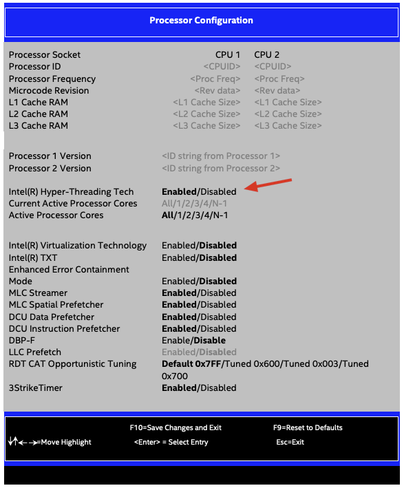

在 AMD 平台上关闭超线程

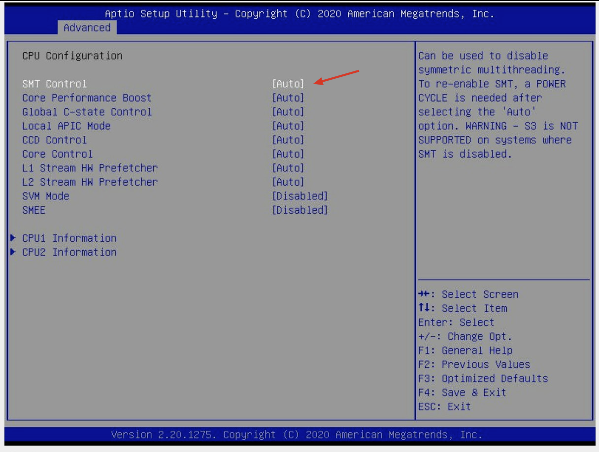

在物理机上查看超线程状态：

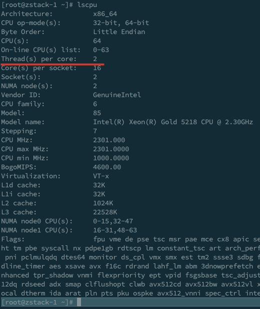

查看同一个 CPU 上的两个超线程，以避免将同一个虚拟机的 vCPU 绑定在同一个 pCPU 的不同 thread 上：

```
cat /proc/cpuinfo | grep -E 'core id|physical id|model name|processor' | grep -E 'core id.*\b0$' -B4
```

#### 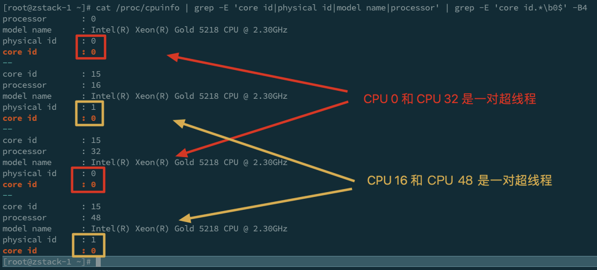

### 打开多 NUMA（AMD上推荐）

#### 原理

AMD 或基于 AMD 的处理器（例如海光处理器）因为 CPU 架构原因，每个 Socket 上会有多个 Memory Controller，造成  CPU 访问不同内存性能不同，此外 DIE 上的  c2c（core-to-core）延时区别也很大，因此应当将底层架构尽量暴露到上次，以方便上层调度优化。

#### 操作

如下图，调整为 NPS=4

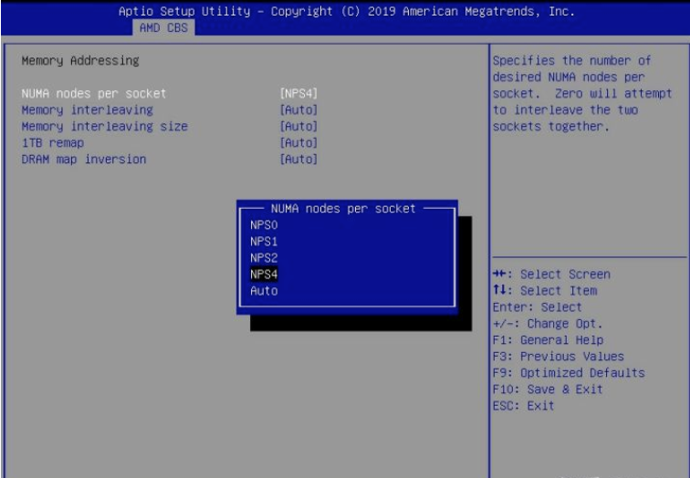

### 其他 BIOS 调整（Intel）

#### 操作

- （推荐）Energy Performance 设置为 Performance
- （可选）CPU C6 Report  根据情况配置是否关闭，关闭后单核Turbo性能可能有所下降，性能会根据稳定，开启后单核Turbo性能会更好一些同时有节能效果。如果最终所有核都会被用起来（或者至少一个Socket的所有核），可以关掉 C6 Report 达到更好地性能稳定性
- （可选）Package C State limit 根据情况配置，与上面的 CPU C6 Report 类似，如果最终所有核都会被用起来（或者至少一个Socket的所有核），可以设置为 C0 达到更好地性能稳定性
- （可选）LLC Dead Line Alloc 根据情况配置，最好在修改前先测试 Workload 并比较，如果关掉之后性能有提高可以关掉
- （推荐）Stale AtoS 对于很多 cross socket 读负载的情况，推荐 Enable
- （可选）Patrol Scrub 对于跑分场景可以关闭，生产环境可以打开，如果需要稳定的低延时，也建议 Disable，Disable 可能影响内存可靠性
- （可选）WR CRC Feature Control 对于跑分场景推荐 Disable，生产环境可以根据性能影响 Enable，Disable 可能影响内存可靠性

此外可以阅读 https://www.cnblogs.com/kongchung/p/9040064.html 和 https://sp.ts.fujitsu.com/dmsp/Publications/public/wp-skylake-RXTX-bios-settings-primergy-ww-en.pdf 了解更多优化和原理

### 其他 BIOS 调整（AMD）

#### 操作

- 参考 AMD 官方 tuning guide：https://developer.amd.com/resources/epyc-resources/epyc-tuning-guides/
- 可以调整 cTDP、Energy Performance 等配置

### 升级内核（推荐）

#### 原理

得益于：

- Limited busy polling（4.6）
- ptr_ring（4.8）
- MSG_MORE in tun_sendmsg（4.11）
- Batch zeroing（4.12）
- Batch dequeuing（4.13）
- kvm halt polling

高版本内核的 virtio、kvm 性能会更好，目前推荐升级到 UEK 5.4.17 版本的内核。

#### 操作

1. 配置uek的源

   1. 在/etc/yum.repos.d/ 目录下 创建一个文件名称可以名为 uek6.repo

   2. 内容编辑为  

      ```
      [uek6]
      
      name=uek6
      baseurl=http://yum.oracle.com/repo/OracleLinux/OL7/UEKR6/x86_64
      gpgcheck=0
      enabled=1
      ```

   3. 然后执行 yum repolist 查看添加的repo

   4. 如果遇到 以下错误 [http://yum.oracle.com/repo/OracleLinux/OL7/UEKR6/x86_64/repodata/repomd.xml](http://yum.oracle.com/repo/OracleLinux/OL7/UEKR5/x86_64/repodata/repomd.xml): [Errno 14] curl#6 - "Could not resolve host: [yum.oracle.com](http://yum.oracle.com/); Unknown error"

      1. 需要配置dns  vim /etc/resolv.conf
      2. 内容添加： nameserver 223.5.5.5 或者nameserver 114.114.114.114

   5. 执行yum repolist 如果没有出现错误 则添加repo成功

2. 配置内核启动参数

   1. 修改/etc/default/grub   在 GRUB_CMDLINE_LINUX 项后添加 noibrs noibpb nopti nospectre_v2  nospectre_v1 l1tf=off nospec_store_bypass_disable no_stf_barrier mds=off mitigations=off 同时建议删除 rhgb quiet
      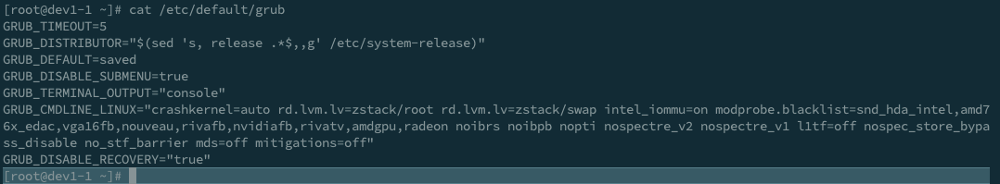
   2. 执行 grub2-mkconfig > /boot/grub2/grub.cfg （如果是 UEFI，需要调整为 UEFI 相应目录）

3. 安装kernel 

   1. 使用yum install kernel-uek

   2. 遇到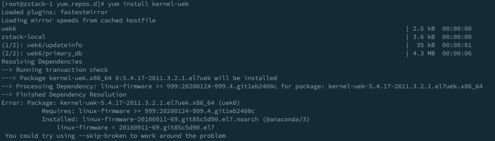这个错误，需要更新较新的linux-firmware版本

   3. 下载新的 firmware： wget https://yum.oracle.com/repo/OracleLinux/OL8/UEKR6/x86_64/getPackage/linux-firmware-20200124-999.4.git1eb2408c.el8.noarch.rpm 

      如果网速不好，可以换成 wget -r -np -nH -R index.html http://192.168.200.100/mirror/wei.wang/uek-kernel/

   4. 安装 ： rpm -ivh linux-firmware-20200124-999.4.git1eb2408c.el8.noarch.rpm --force  为什么使用–force 参数 因为单独安装一个下载的rpm包 会有一些依赖 需要强制安装

   5. yum install kernel-uek

      如果网速不好，可以通过前面的 wget -r -np -nH -R index.html http://192.168.200.100/mirror/share/wei.wang/uek_c7r6/ 对下载下来的包执行 
      rpm -ivh kernel-uek-5.4.17-2011.4.6.el7uek.x86_64.rpm

4. 检查kernel 是否安装成功

   1. 执行 grubby --info=ALL 如果有 CentOS Linux (5.4.17-2011.4.6.el7uek.x86_64) 7 (Core) 说明安装成功

5. 设置为这个kernel为默认启动项

   1. grub2-set-default 'CentOS Linux (5.4.17-2011.4.6.el7uek.x86_64) 7 (Core)'
   2. 执行 grubby --default-kernel 输出 5.4.17 说明成功

6. 重启服务器，启动后查看是否使用这个kernel

   1.  cat /proc/cmdline
      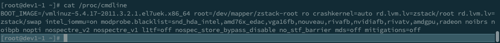

### 调整物理网卡参数（部分推荐）

#### 原理

物理网卡的 RIng Buffer、中断聚合等最好根据实际测试调整，offload 在没有 bug 的前提下尽量打开

#### 操作

- （大部分情况推荐）调整 ring buffer 为 256，ethtool -G ens1f0 rx 256 tx 256
- （推荐）调整 udp hash 策略为 IP+Port，ethtool -N ens1f0 rx-flow-hash udp4 sdnf
- （可选）调整中断聚合，关闭自动中断聚合，最好在 irq 显著很高的时候再调整，酌情调整 ethtool -C ens1f0
- （推荐）检查网卡 offload feature 是否打开，最好对比测试后调整，ethtool -k ens1f0 | grep -v 'fixed'，例如 Mellanox 建议关闭 tx-nocache-copy 

需要持久化的话，参考 https://www.thegeekdiary.com/how-to-make-ethtool-settings-persistent-across-reboots-in-centos-rhel-67/ 操作

### 跳过 zsn 网络规则（推荐）

#### 原理

zsn 会对特殊的 ip proto 通过 nflog 的方式进行收集，3.9 及 3.9 之前的版本在规则上没有做合适的优化，导致网络流量较高时且物理网卡、vlan 子接口较多时，nflog 规则产生一定的 overhead，推荐通过手动添加规则绕过

3.9.2 以上的版本不需要手动增加这条规则

#### 操作

执行 iptables -t raw -I PREROUTING ! -p 253 -j ACCEPT

### 关闭 iptables、ebtables（可选）

#### 原理

iptables、ebtables 在流量较高的时候会产生一定的 overhead，如果实际不使用安全组，特别是在 PK 场景下，可以暂时将 iptables、ebtables  关闭，此时建议通过 CLI 创建 L3 网络，不依赖平台的安全组、分布式DHCP、Userdata 等扁平网络服务，VPC  提供的网络服务还是可用的（例如 VPC 提供的 DHCP、防火墙、EIP 等）。

#### 操作

下面命令考虑到了 CentOS 7、CentOS 8 的场景，因此部分命令 CentOS 7 下可能报错，可以无视

```
nft flush ruleset
iptables -w -F
iptables -w -t nat -F
iptables -w -t raw -F
iptables -w -t mangle -F
iptables -w -t nat -F
iptables -w -X
iptables -w -t nat -X
iptables -w -t raw -X
iptables -w -t mangle -X
iptables -w -t nat -X
ip6tables -w -F
ip6tables -w -X
ebtables -F
ebtables -X
sysctl -w net.bridge.bridge-nf-call-iptables=0
modprobe -r iptable_raw
modprobe -r ip6table_raw
modprobe -r ip6table_mangle
modprobe -r ip6table_nat
modprobe -r ip6table_mangle
modprobe -r iptable_nat
modprobe -r iptable_filter
modprobe -r iptable_mangle
modprobe -r ip6table_filter
modprobe -r ip6_tables
modprobe -r nf_nat
modprobe -r ip_tables
modprobe -r xt_nat
modprobe -r xt_conntrack
modprobe -r ebtable_filter
modprobe -r ebtable_nat
modprobe -r ebtables
```

### 调整 NAPI 参数（可选）

#### 原理

NAPI 会通过 polling + 中断结合的方式来收包，一般认为 polling 可以在流量高的时候更充分的使用 CPU，因此可以调整参数多使用 polling。

但是这样也可能造成资源浪费，因此可以根据 /proc/net/softnet_stat 来考虑是否要调整，proc 的数据比较原始，可以通过 https://raw.githubusercontent.com/majek/dump/master/how-to-receive-a-packet/softnet.sh 来 parse proc 数据。

数据介绍在脚本有，NAPI 参数介绍可以参考 https://awesomeopensource.com/project/leandromoreira/linux-network-performance-parameters

#### 操作

sysctl -w net.core.netdev_max_backlog=100000
sysctl -w net.core.netdev_budget=50000
sysctl -w net.core.netdev_budget_usecs=5000
sysctl -w net.core.dev_weight=6000

### 调整 kvm_amd 参数（AMD推荐）

#### 原理

- 关于 AVIC 参考 https://lwn.net/Articles/675382/

#### 操作

在所有虚拟机关机条件下，修改 /etc/modprobe.d/kvm.conf 增加 options kvm_amd avic=1

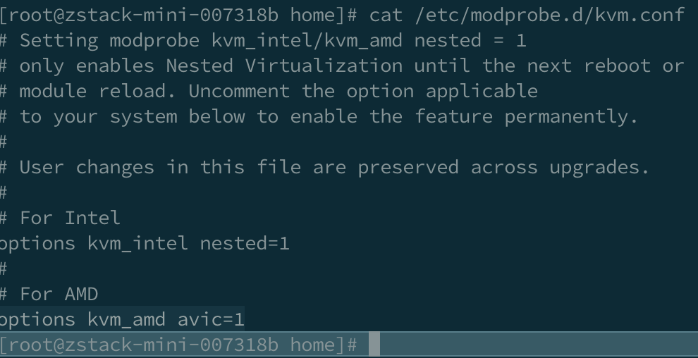

## 平台侧配置

### 设置 vCPU 绑定（推荐）

#### 原理

在没有其他任务干扰的情况下，可以通过 CPU 绑定来提高 CPU 的 cache hit，但是要注意合适的任务调度和 NUMA 调度。

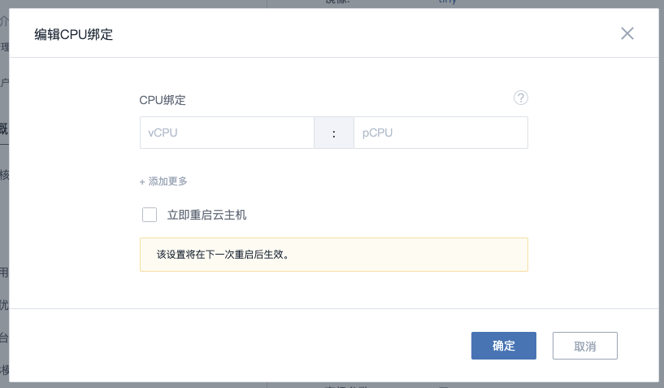

举例来说，如果是本地存储、SharedBlock 存储，物理机上没有太多其他较大占用 CPU 的进程，那么可以尽量让虚拟户将 CPU 吃满，如果是超融合场景，那么要考虑 Ceph  的资源占用，如果是纯 PK、演示场景，测试的 workload 里 ceph 也没有明显资源占用，那么也可以先暂时忽略 ceph  的资源影响，但生产环境还是要考虑的。

目前大多数环境都是双路 Intel 服务器，在关闭超线程后，基本就是一个 socket 一个  NUMA 节点，对于吞吐场景，此时可以简单的将虚拟机配置为一个 NUMA 节点（最好每个 NUMA 都保留一个 pCPU  以避免有进程与虚拟机抢占 CPU 资源），vhost 配置一个 NUMA 节点（这样会导致数据跨 NUMA 可能会轻微增加延迟，但吞吐更好）。

此外 vCPU 建议绑在与网卡相同的 NUMA 节点上，查看网卡所在的 NUMA 的节点：

```
cat /sys/class/net/ens1f0/device/numa_node
```

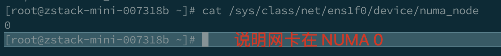

目前平台不支持 pin emulator，因此可以考虑手动 pin emulator（参考下面虚拟机 XML）。

### 适当的 CPU、内存（推荐）

#### 原理

对于宿主机来说，vCPU 本质上就是一个线程，而不是一个真实的 CPU 的，因此朴素的 CPU 越多性能越好这个想法是并不正确的，考虑到内核调度、其他进程需要使用的资源，合适的 CPU、内存数量才能够提升整体性能，而不是盲目求大。

对于一个虚拟机占满一个 NUMA 的场景，最好给该 NUMA 保留一到两个 CPU，给该 NUMA 酌情保留内存，特别是 AMD 类的 NUMA  很多的场景，虽然看似物理机内存其实很多，但不正确的内存调度会极大影响整体性能，甚至导致 kswapd CPU 占用很高，因此建议至少每个  NUMA 保留 2~4GB 内存，如果是 NUMA 0、或者超融合场景，更要保留更多的内存。

对于追求性能的场景，CPU 和内存都不可以超分，甚至要酌情缩分，例如关闭超线程后2个socket32核的物理机，最好只创建两个 14 核的虚拟机，如果是超融合，最好只创建一个 10核（根据osd数量酌情调整）的虚拟机加一个14核的虚拟机。

而且在追求单个虚拟机很大网络 IO 时，还要为 vhost 线程留下资源，还是以关闭超线程后2个socket32核的物理机非超融合为例，最好只创建一个 14  核的虚拟机，然后另外 14 核留给 vhost 用，可以通过下面介绍的虚拟机 XML 来指定 vhost 线程（emulator）和 pCPU  的对应关系。当然，一般用户不需要如此高的流量的话，留一到两个 vhost 线程足以支撑几十万的 pps。

#### 操作

在虚拟机规格里设置适当的规格。

### 设置虚拟网卡多队列（推荐）

#### 原理

可以参考 https://huataihuang.gitbooks.io/cloud-atlas/virtual/kvm/performance/kvm_performance_tunning_in_action/multi_queue-virtio-net.html

简单来说，网卡队列与中断相关，与 vhost 线程数量相关，因此在一定范围内多一些性能会更好，但并不是简单地越多越好。

对于 3.10 级以上版本，ZStack 会自动对 Linux 云主机配置虚拟网卡多队列，详细参考                     [ZSTAC-28545](http://jira.zstack.io/browse/ZSTAC-28545?src=confmacro)                            -            虚拟机默认打开网卡多队列                                                Closed                

#### 操作

根据 vCPU、pCPU 数目设置合适的队列数量，例如 vCPU 9 个，队列数量可以在 4~9个之间进行调试

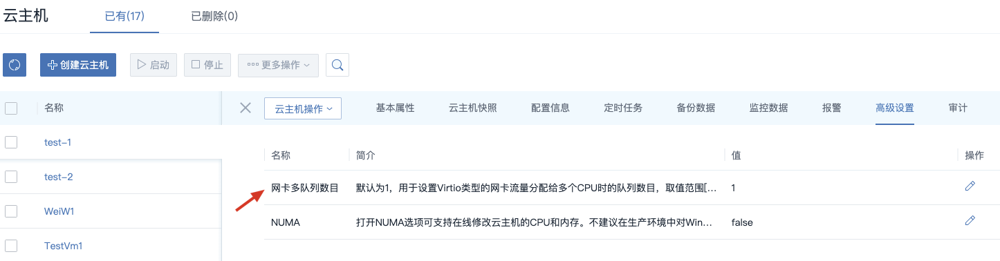

#### 云主机内部设置xps（推荐）

##### 原理

vhost线程跟 云主机网卡队列1:1 map，举个例子：云主机发包的时候，如果包是放在tx-1队列上，就会由一个特定不变的vhost线程进行取包，发送到tap设备

云主机发包简化过程：
→ 如果网卡驱动实现了 队列选择器，则使用网卡驱动实现的队列选择器

 → 不然：xps 队列选择

  → 哈希选择队列：报文的五元组信息计算hash值

##### 操作

| 云主机内核版本 | xps                                                          | 操作                                                         | 测试命令                              |
| -------------- | ------------------------------------------------------------ | ------------------------------------------------------------ | ------------------------------------- |
| 3.10           | 不支持virtio驱动实现了队列选择器，会使用virtio实现的队列选择器 | iperf -P 8 原因：virtio驱动实现的队列选择：发送报文时，当前cpu对应 的tx queue。每个cpu对应一个tx queue，这个是在初始化时就确定好了的。 | server: iperf -P client: iperf -P 8   |
| 4.18           | 支持virtio驱动没有实现了队列选择器，会使用xps队列选择        | 配置网卡xps 队列选择，让网卡队列可以hash到所有cpu[xps.sh](file:///download/attachments/177266962/xps.sh?version=1&modificationDate=1729237996000&api=v2) | server: iperf3 -P client: iperf3 -P 8 |
|                |                                                              |                                                              |                                       |

### 开启 tx zero copy（可选）

#### 操作

对于大包场景（例如 iperf 测试）可以打开

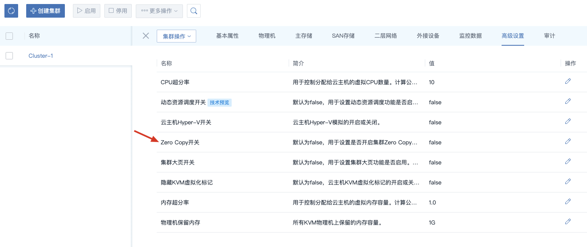

### 打开大页内存（可选）

#### 操作

对于虚拟机内跑内存密集业务（例如 redis、数据库）有帮助，对网络性能本身没有明显帮助

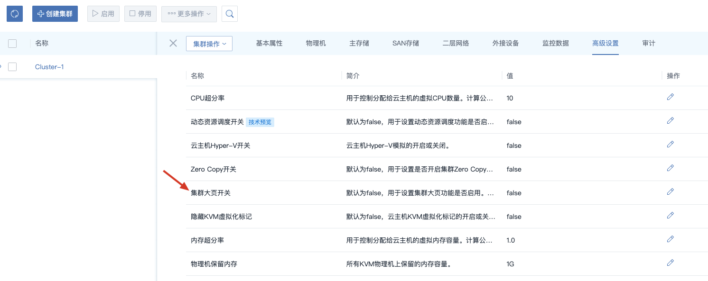

### 检查 EPT、hyper-v、CPU Model 等参数（推荐）

#### 操作

- EPT 检查
  - 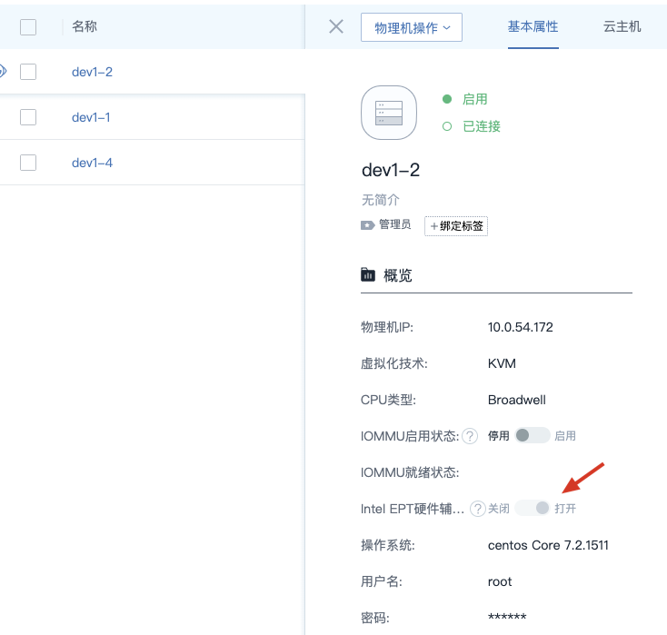
- 对于有 Windows 虚拟机的情况，需要开启 hyper-v 模拟（Windows虚拟机ZStack会自动隐藏KVM标记）
  - 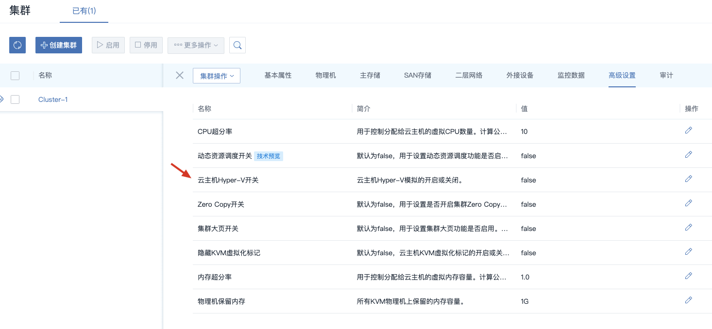
- CPU 配置
  - 
  - 其中，对 AMD 虚拟机在低版本qemu（3.1以下），更推荐 host-model 而不是 host-passthrough

## 虚拟机 XML

下面 XML 是在 2 个 socket，每个 socket 10 个核心，socket 0 为 cpu 0-9，socket 1 为 cpu  10-19，打开超线程的 socket 0 为 cpu 20-29，socket 1 为 cpu 30-39，网卡为 X710，位于 NUMA 0 即 Socket 0 上。

测试虚拟网卡为 vnic1.1 和 vnic1.2，修改重点是这**两个虚拟网卡的定义和 CPU、emulator 的 pin**

```
<domain type='kvm' id='1' xmlns:qemu='http://libvirt.org/schemas/domain/qemu/1.0'>
  <name>612bd92c8a2a4817b23d13c599431426</name>
  <uuid>612bd92c-8a2a-4817-b23d-13c599431426</uuid>
  <description>Test1</description>
  <metadata xmlns:zs="http://zstack.org">
    <zs:zstack>
      <internalId>2921</internalId>
      <hostManagementIp>10.0.31.77</hostManagementIp>
    </zs:zstack>
  </metadata>
  <maxMemory slots='10' unit='KiB'>34359738368</maxMemory>
  <memory unit='GiB'>16</memory>
  <currentMemory unit='GiB'>16</currentMemory>
  <vcpu placement='static' current='9'>128</vcpu>

  <memoryBacking>
    <hugepages/>
  </memoryBacking>
  <cputune>
    <shares>512</shares>
    <vcpupin vcpu="0" cpuset="1"/>
    <vcpupin vcpu="1" cpuset="2"/>
    <vcpupin vcpu="2" cpuset="3"/>
    <vcpupin vcpu="3" cpuset="4"/>
    <vcpupin vcpu="4" cpuset="5"/>
    <vcpupin vcpu="5" cpuset="6"/>
    <vcpupin vcpu="6" cpuset="7"/>
    <vcpupin vcpu="7" cpuset="8"/>
    <vcpupin vcpu="8" cpuset="9"/>
    <emulatorpin cpuset="11-19"/>
  </cputune>

  <numatune>
    <memnode cellid="0" mode="strict" nodeset="0"/>
  </numatune>

  <resource>
    <partition>/machine</partition>
  </resource>
  <sysinfo type='smbios'>
    <system>
      <entry name='serial'>0672fa6b-9913-4284-a1dd-39c1c129b92e</entry>
    </system>
  </sysinfo>
  <os>
    <type arch='x86_64' machine='pc-i440fx-5.0'>hvm</type>
    <bootmenu enable='yes'/>
    <smbios mode='sysinfo'/>
  </os>
  <features>
    <acpi/>
    <apic/>
    <pae/>
  </features>
  <cpu mode='host-passthrough'>
    <cache mode='passthrough'/>
    <topology sockets='1' cores='128' threads='1'/>
    <numa>
      <cell id='0' cpus='0-127' memory='16' unit='GiB' memAccess='shared'/>
    </numa>
  </cpu>
  <clock offset='utc'/>
  <on_poweroff>destroy</on_poweroff>
  <on_reboot>restart</on_reboot>
  <on_crash>restart</on_crash>
  <devices>
    <emulator>/usr/local/bin/qemu-system-x86_64</emulator>
    <disk type='file' device='disk' snapshot='external'>
      <driver name='qemu' type='qcow2' cache='none' io='native'/>
      <source file='/home/images/ZStack_3.8.2_ComputeNode_20G.qcow2'/>
      <target dev='vda' bus='virtio'/>
      <boot order='1'/>
      <alias name='virtio-disk0'/>
      <address type='pci' domain='0x0000' bus='0x00' slot='0x0b' function='0x0'/>
    </disk>
    <controller type='scsi' index='0' model='virtio-scsi'>
      <alias name='scsi0'/>
      <address type='pci' domain='0x0000' bus='0x00' slot='0x05' function='0x0'/>
    </controller>
    <controller type='pci' index='0' model='pci-root'>
      <alias name='pci.0'/>
    </controller>
    <controller type='ide' index='0'>
      <alias name='ide'/>
      <address type='pci' domain='0x0000' bus='0x00' slot='0x01' function='0x1'/>
    </controller>
    <controller type='virtio-serial' index='0'>
      <alias name='virtio-serial0'/>
      <address type='pci' domain='0x0000' bus='0x00' slot='0x0a' function='0x0'/>
    </controller>
    <interface type='bridge'>
      <mac address='fa:d6:c7:18:8c:00'/>
      <source bridge='br_bond0_26'/>
      <target dev='vnic1.0'/>
      <model type='virtio'/>
      <alias name='net0'/>
      <address type='pci' domain='0x0000' bus='0x00' slot='0x03' function='0x0'/>
    </interface>

    <interface type='bridge'>
      <source bridge='br_ens1f0'/>
      <mac address='fa:9b:4d:23:e1:01'/>
      <model type='virtio'/>
      <target dev='vnic1.1'/>
      <driver name='vhost' queues='9' rx_queue_size='256' tx_queue_size='256'>
      </driver>
      <coalesce>
        <rx>
          <frames max='32'/>
        </rx>
      </coalesce>
      <address type='pci' domain='0x0000' bus='0x00' slot='0x04' function='0x0'/>
    </interface>
    <interface type='bridge'>
      <source bridge='br_ens1f1'/>
      <mac address='fa:a8:80:2e:67:02'/>
      <model type='virtio'/>
      <target dev='vnic1.2'/>
      <driver name='vhost' queues='9' rx_queue_size='256' tx_queue_size='256'>
      </driver>
      <coalesce>
        <rx>
          <frames max='32'/>
        </rx>
      </coalesce>
      <address type='pci' domain='0x0000' bus='0x00' slot='0x07' function='0x0'/>
    </interface>

    <serial type='pty'>
      <source path='/dev/pts/0'/>
      <target port='0'/>
      <alias name='serial0'/>
    </serial>
    <console type='pty' tty='/dev/pts/0'>
      <source path='/dev/pts/0'/>
      <target type='serial' port='0'/>
      <alias name='serial0'/>
    </console>
    <channel type='unix'>
      <source mode='bind' path='/var/lib/libvirt/qemu/d680c6d730074300b0bc6aa21cc7d97f'/>
      <target type='virtio' name='org.qemu.guest_agent.0' state='disconnected'/>
      <alias name='channel0'/>
      <address type='virtio-serial' controller='0' bus='0' port='1'/>
    </channel>
    <input type='mouse' bus='ps2'>
      <alias name='input1'/>
    </input>
    <input type='keyboard' bus='ps2'>
      <alias name='input2'/>
    </input>
    <graphics type='vnc' port='5900' autoport='yes' listen='0.0.0.0'>
      <listen type='address' address='0.0.0.0'/>
    </graphics>
    <video>
      <model type='cirrus' vram='16384' heads='1' primary='yes'/>
      <alias name='video0'/>
      <address type='pci' domain='0x0000' bus='0x00' slot='0x02' function='0x0'/>
    </video>
  </devices>
  <seclabel type='none' model='none'/>

</domain>
```

## 效果展示

上述优化后，使用普通 CentOS 7.4 虚拟机做网络路由，可以达到 2Mpps 丢包 0.07%

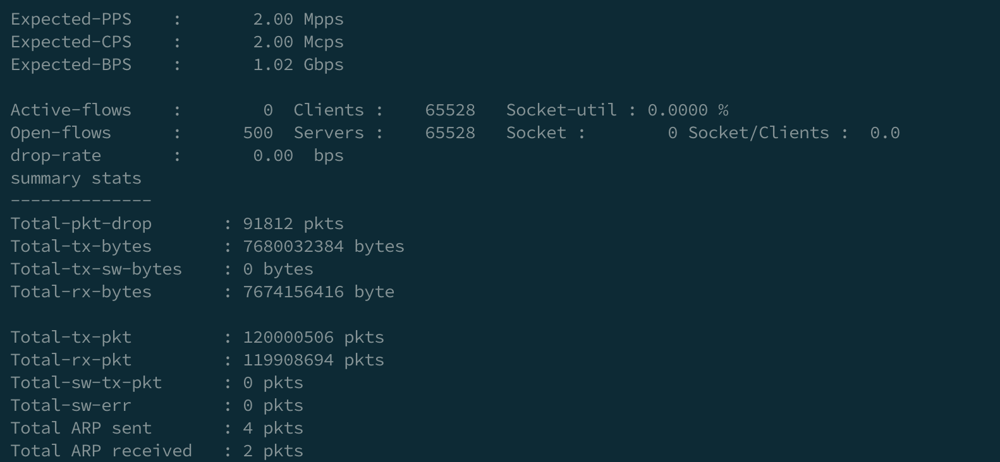

1.9Mpps 几乎不丢包

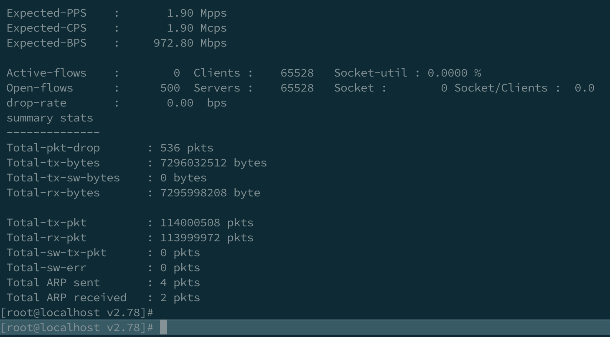

1.8Mpps 严格不丢包

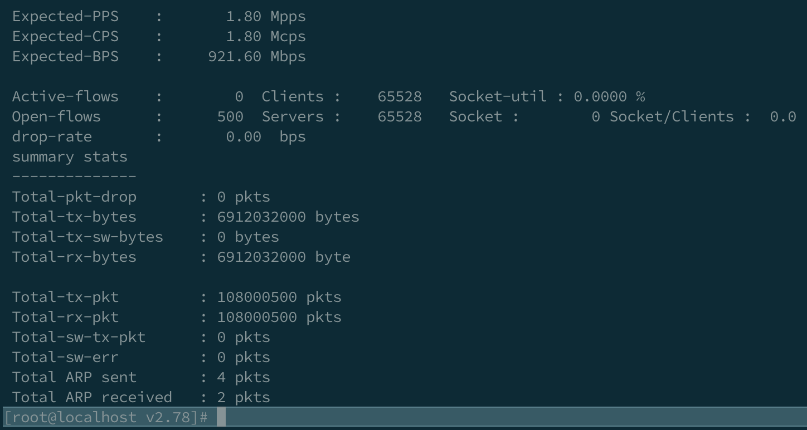

这个性能与虚拟机通过直通直接使用 SRIOV 网卡性能基本接近，可以认为到达了虚拟机内核本身转发网络报文的性能极限。

## Attachments: